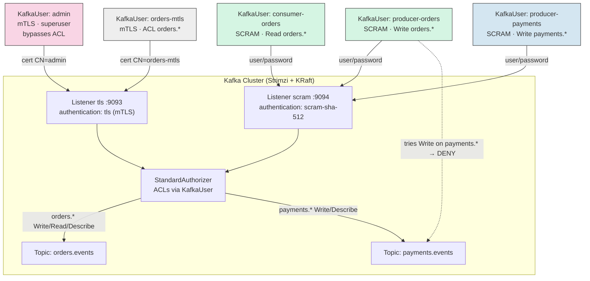
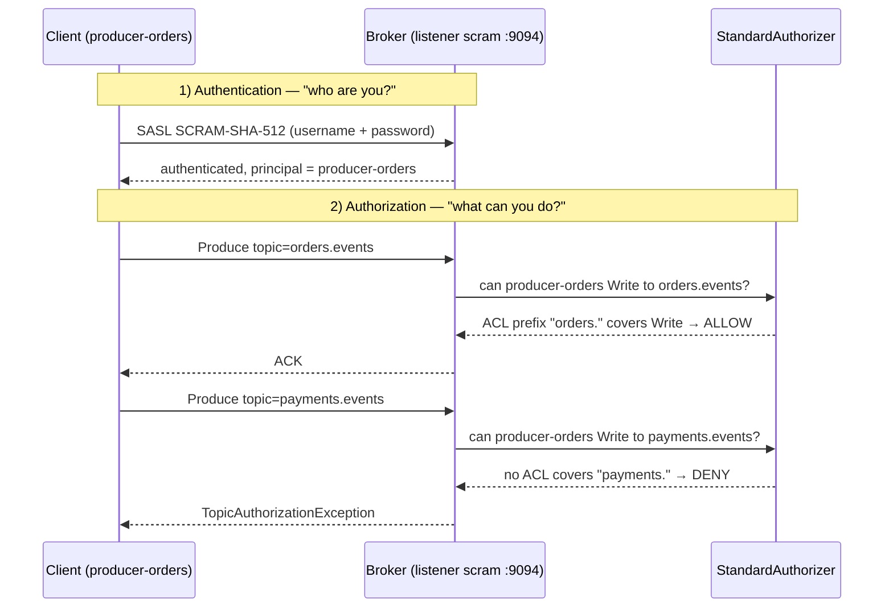

# Authentication and Authorization on Strimzi — mTLS, SCRAM and Multi-Tenant ACLs

> **Goal:** Move on from the "open" cluster of the previous Days to a **production-grade**
> setup: TLS-only listeners, two authentication mechanisms (**mTLS** and **SCRAM-SHA-512**)
> coexisting on the same cluster, authorization via **ACLs** using KRaft's native
> `StandardAuthorizer`, and a real **multi-tenant** scenario (`orders` and `payments` teams)
> isolated by topic-name convention.

---

## Table of Contents

1. [Context](#1-context)
2. [Authentication vs. Authorization — the two planes](#2-authentication-vs-authorization--the-two-planes)
3. [Prerequisites](#3-prerequisites)
4. [Lab Structure](#4-lab-structure)
5. [Bringing Up the Kind Cluster](#5-bringing-up-the-kind-cluster)
6. [Installing the Strimzi Cluster Operator](#6-installing-the-strimzi-cluster-operator)
7. [Deploying: Kafka with TLS and SCRAM Listeners](#7-deploying-kafka-with-tls-and-scram-listeners)
8. [Creating Topics and KafkaUsers](#8-creating-topics-and-kafkausers)
9. [Extracting Credentials from the Secrets](#9-extracting-credentials-from-the-secrets)
10. [Testing mTLS with the `admin` User](#10-testing-mtls-with-the-admin-user)
11. [Testing SCRAM-SHA-512 with `producer-orders` / `consumer-orders`](#11-testing-scram-sha-512-with-producer-orders--consumer-orders)
12. [mTLS with an ACL-Restricted User (Not a Superuser)](#12-mtls-with-an-acl-restricted-user-not-a-superuser)
13. [The Negative Test: Multi-Tenant Isolation](#13-the-negative-test-multi-tenant-isolation)
14. [Per-User Quotas](#14-per-user-quotas)
15. [Other Configs Worth Exploring](#15-other-configs-worth-exploring)
16. [Cleanup](#16-cleanup)
17. [References](#17-references)

---

## 1. Context

From [Day 1](../Day1-Introducao/) through [Day 3](../Day3-NodePools-Avancado/) we ran Kafka
with a `plain` listener (no TLS, no authentication) — great for focusing on Node Pools and
KRaft without noise, terrible for anything beyond your laptop. This Day 4 closes that gap
with what every production cluster needs:

- **No listener without TLS.** All client-facing traffic is encrypted.
- **Two authentication mechanisms on the same cluster:** `tls` (mTLS, client certificate
  signed by Strimzi's CA) for automation/admin, and `scram-sha-512` (username/password) for
  applications — the most common pattern in hybrid environments, where not every application
  can handle mTLS but all of them can do SASL.
- **Granular authorization via ACLs**, declaratively managed through `KafkaUser` — nobody
  runs `kafka-acls.sh` by hand in production.
- **A real multi-tenant scenario:** two teams, `orders` and `payments`, each with their own
  topics (`orders.` / `payments.` prefix convention) and users that only see their own
  namespace.

Overview of what we're about to build — two TLS listeners (different authentication
mechanisms), a single authorizer deciding what each `KafkaUser` can do, and two tenants
isolated purely by ACL:



## 2. Authentication vs. Authorization — the two planes

It's common to conflate the two, but they're independent, sequential layers:

| Layer | Question it answers | Where it's configured in Strimzi |
|---|---|---|
| **Authentication** | "Who are you?" | `Kafka.spec.kafka.listeners[].authentication` (credential type accepted by the listener) and `KafkaUser.spec.authentication` (credential type generated for that user) |
| **Authorization** | "Now that we know who you are, what can you do?" | `Kafka.spec.kafka.authorization` (cluster's authorization engine) and `KafkaUser.spec.authorization.acls` (that user's rules) |

A user can authenticate successfully (correct password, valid certificate) and still get a
`TopicAuthorizationException` on the first operation — authentication only proves identity;
what that identity is allowed to do is decided by the **authorizer**.

> **Note on the authorizer:** with `Kafka.spec.kafka.authorization.type: simple`, Strimzi
> resolves to the correct native implementation based on the cluster's metadata mode. Since
> every current Strimzi cluster runs on **KRaft** (Zookeeper was removed in 0.46 — same note
> we made in [Day 1](../Day1-Introducao/)), `type: simple` here means
> `org.apache.kafka.metadata.authorizer.StandardAuthorizer`, Kafka's native authorizer that
> stores ACLs in the KRaft metadata log itself (no Zookeeper, no legacy `AclAuthorizer`).

The two layers in sequence, with the same request passing through authentication and then
hitting (or not) the authorizer:



## 3. Prerequisites

- [Docker](https://docs.docker.com/get-docker/) with at least ~4GB of free RAM
- [kind](https://kind.sigs.k8s.io/docs/user/quick-start/#installation)
- [kubectl](https://kubernetes.io/docs/tasks/tools/#kubectl)
- `openssl` (optional, only if you want to inspect the generated certificates)
- Having done [Day 2](../Day2-NodePools/) (we assume you already know `KafkaNodePool`)

## 4. Lab Structure

```
Day4-Autenticacao-Autorizacao/
├── kind-config.yaml                # kind cluster: 1 control-plane + 2 workers
├── kafka-nodepool-controller.yaml  # "controller" KafkaNodePool (3 replicas)
├── kafka-nodepool-broker.yaml      # "broker" KafkaNodePool (3 replicas)
├── kafka-cluster.yaml              # Kafka CR: tls + scram listeners, simple authorization
├── kafka-topic-orders.yaml         # "orders.events" KafkaTopic
├── kafka-topic-payments.yaml       # "payments.events" KafkaTopic
├── kafkauser-admin.yaml            # mTLS KafkaUser, superuser
├── kafkauser-producer-orders.yaml  # SCRAM KafkaUser, Write+Describe on orders.*
├── kafkauser-consumer-orders.yaml  # SCRAM KafkaUser, Read+Describe on orders.* + group
├── kafkauser-producer-payments.yaml# SCRAM KafkaUser, Write+Describe on payments.*
├── kafkauser-orders-mtls.yaml      # Restricted mTLS KafkaUser (not a superuser), Write+Read+Describe on orders.*
├── README.md
└── README-EN.md
```

## 5. Bringing Up the Kind Cluster

```bash
kind create cluster --config=kind-config.yaml --name strimzi-day4
kubectl get nodes -o wide
```

## 6. Installing the Strimzi Cluster Operator

```bash
kubectl create namespace kafka

curl -L https://github.com/strimzi/strimzi-kafka-operator/releases/download/1.1.0/strimzi-cluster-operator-1.1.0.yaml \
  | sed 's/namespace: myproject/namespace: kafka/g' \
  | kubectl create -f - -n kafka

kubectl wait deployment/strimzi-cluster-operator -n kafka --for=condition=Available --timeout=180s
```

## 7. Deploying: Kafka with TLS and SCRAM Listeners

[`kafka-cluster.yaml`](kafka-cluster.yaml) defines two internal listeners, **both with
`tls: true`**, differing only in the authentication mechanism:

```yaml
listeners:
  - name: tls
    port: 9093
    type: internal
    tls: true
    authentication:
      type: tls          # mTLS — client presents a certificate signed by the cluster CA
  - name: scram
    port: 9094
    type: internal
    tls: true
    authentication:
      type: scram-sha-512  # SASL — client presents a username/password
authorization:
  type: simple
  superUsers:
    - CN=admin            # an mTLS user's principal is the certificate's full CN
```

```bash
kubectl apply -f kafka-nodepool-controller.yaml -n kafka
kubectl apply -f kafka-nodepool-broker.yaml -n kafka
kubectl apply -f kafka-cluster.yaml -n kafka

kubectl wait kafka/my-cluster --for=condition=Ready --timeout=300s -n kafka
kubectl get pods -n kafka
```

## 8. Creating Topics and KafkaUsers

```bash
kubectl apply -f kafka-topic-orders.yaml -n kafka
kubectl apply -f kafka-topic-payments.yaml -n kafka

kubectl apply -f kafkauser-admin.yaml -n kafka
kubectl apply -f kafkauser-producer-orders.yaml -n kafka
kubectl apply -f kafkauser-consumer-orders.yaml -n kafka
kubectl apply -f kafkauser-producer-payments.yaml -n kafka
kubectl apply -f kafkauser-orders-mtls.yaml -n kafka

kubectl get kafkauser -n kafka
```

Notice you **never run `kafka-acls.sh` yourself**: each `KafkaUser`'s
`spec.authorization.acls` is read by the **User Operator**, which calls the Kafka Admin API
and reconciles ACLs automatically — the same way the Topic Operator handles `KafkaTopic`.
That's what makes this model GitOps-auditable: the permission state lives in versioned YAML,
not in one-off commands someone ran once.

`producer-orders` only has `Write` + `Describe` on the `orders.` prefix — no `Create`. That's
intentional: topic creation is the Topic Operator's job via `KafkaTopic` ([section
8](#8-creating-topics-and-kafkausers) already created both topics), not the producing
application's. If your app relies on `auto.create.topics.enable=true` on the client side,
it'll also need the `Create` operation — but that's an anti-pattern in production: implicitly
created topics end up with default config, no thought-out `min.insync.replicas` or retention.

## 9. Extracting Credentials from the Secrets

Strimzi creates a `Secret` with the same name as each `KafkaUser`. Its contents depend on
the authentication type:

| Type | Relevant keys in the Secret |
|---|---|
| `tls` | `ca.crt`, `user.crt`, `user.key`, `user.p12` (ready-made PKCS12 keystore), `user.password` |
| `scram-sha-512` | `password`, `sasl.jaas.config` (JAAS **already assembled**, with the username and password baked in) |

And the cluster CA lives in a separate Secret, created alongside the `Kafka` CR:

```bash
mkdir -p /tmp/day4-certs && cd /tmp/day4-certs

# Cluster CA truststore (validates the server on any TLS listener)
kubectl get secret my-cluster-cluster-ca-cert -n kafka -o jsonpath='{.data.ca\.p12}'     | base64 -d > truststore.p12
kubectl get secret my-cluster-cluster-ca-cert -n kafka -o jsonpath='{.data.ca\.password}' | base64 -d > truststore.password

# Keystore for the mTLS "admin" user
kubectl get secret admin -n kafka -o jsonpath='{.data.user\.p12}'     | base64 -d > admin.p12
kubectl get secret admin -n kafka -o jsonpath='{.data.user\.password}' | base64 -d > admin.password

# Password for the SCRAM users
kubectl get secret producer-orders -n kafka -o jsonpath='{.data.password}' | base64 -d > producer-orders.password
kubectl get secret consumer-orders -n kafka -o jsonpath='{.data.password}' | base64 -d > consumer-orders.password

# Keystore for the ACL-restricted mTLS user "orders-mtls" (not a superuser)
kubectl get secret orders-mtls -n kafka -o jsonpath='{.data.user\.p12}'     | base64 -d > orders-mtls.p12
kubectl get secret orders-mtls -n kafka -o jsonpath='{.data.user\.password}' | base64 -d > orders-mtls.password
```

## 10. Testing mTLS with the `admin` User

Spin up a persistent working pod (no `--rm`, so there's time to `kubectl cp` files in) using
the same Kafka image the operator uses:

```bash
kubectl run kafka-client -n kafka --image=quay.io/strimzi/kafka:1.1.0-kafka-4.3.0 \
  --command -- sleep infinity

kubectl cp /tmp/day4-certs/truststore.p12 kafka-client:/tmp/truststore.p12 -n kafka
kubectl cp /tmp/day4-certs/admin.p12      kafka-client:/tmp/admin.p12      -n kafka
```

Inside the pod, build the `client.properties` file for mTLS (using the passwords read into
`admin.password` / `truststore.password`):

```bash
kubectl exec -ti kafka-client -n kafka -- bash -c 'cat > /tmp/admin.properties <<EOF
security.protocol=SSL
ssl.truststore.location=/tmp/truststore.p12
ssl.truststore.password='"$(cat /tmp/day4-certs/truststore.password)"'
ssl.truststore.type=PKCS12
ssl.keystore.location=/tmp/admin.p12
ssl.keystore.password='"$(cat /tmp/day4-certs/admin.password)"'
ssl.keystore.type=PKCS12
EOF'
```

Test it: since `admin` is a `superUser`, it bypasses ACL checks for any operation — a good
way to confirm authentication itself is working before touching ACLs:

```bash
kubectl exec -ti kafka-client -n kafka -- \
  bin/kafka-topics.sh --bootstrap-server my-cluster-kafka-bootstrap:9093 \
  --command-config /tmp/admin.properties --list
```

Expected output:

```
orders.events
payments.events
```

## 11. Testing SCRAM-SHA-512 with `producer-orders` / `consumer-orders`

The big win with SCRAM here: **the Secret already ships with a ready-made
`sasl.jaas.config`**, no need to hand-assemble the string:

```bash
kubectl exec -ti kafka-client -n kafka -- bash -c '
JAAS=$(kubectl get secret producer-orders -n kafka -o jsonpath="{.data.sasl\.jaas\.config}" | base64 -d)
cat > /tmp/producer-orders.properties <<EOF
security.protocol=SASL_SSL
sasl.mechanism=SCRAM-SHA-512
sasl.jaas.config=$JAAS
ssl.truststore.location=/tmp/truststore.p12
ssl.truststore.password='"$(cat /tmp/day4-certs/truststore.password)"'
ssl.truststore.type=PKCS12
EOF'
```

> Note: the command above runs `kubectl` **inside** the pod, which means `kubectl` must be
> installed in the image — if you'd rather not, generate the `.properties` file locally
> (outside the pod, using the same `jsonpath` from section 9) and `kubectl cp` the finished
> file in, like we did with the `.p12` files. Simpler, and closer to how a real CI pipeline
> injects secrets.

Repeat the same process for `consumer-orders.properties`, swapping the username in the
`jsonpath`. With both files in the pod:

**Produce to `orders.events` (allowed):**

```bash
kubectl exec -ti kafka-client -n kafka -- \
  bin/kafka-console-producer.sh --bootstrap-server my-cluster-kafka-bootstrap:9094 \
  --topic orders.events --producer.config /tmp/producer-orders.properties
```

**Consume from `orders.events` (allowed, group `orders-consumer-checkout`, which matches
the `orders-consumer-` prefix that's authorized for this user):**

```bash
kubectl exec -ti kafka-client -n kafka -- \
  bin/kafka-console-consumer.sh --bootstrap-server my-cluster-kafka-bootstrap:9094 \
  --topic orders.events --group orders-consumer-checkout --from-beginning \
  --consumer.config /tmp/consumer-orders.properties
```

Messages typed in the producer should show up in the consumer, just like in previous
Days — except now going through TLS + SASL end to end.

## 12. mTLS with an ACL-Restricted User (Not a Superuser)

The mTLS example in [section 10](#10-testing-mtls-with-the-admin-user) uses the `admin`
user, which is a `superUser` — it bypasses ACL checks for any operation, so that test only
proves mTLS **authentication** works; it says nothing about **authorization**. This second
example closes that gap: same authentication mechanism (`type: tls`, a certificate signed
by the cluster CA, PKCS12 keystore), but for an ordinary user with ACLs as restricted as
`producer-orders`/`consumer-orders` in the previous section. The only difference between
this `KafkaUser` and the SCRAM ones from section 11 is the **authentication mechanism** —
the authorization (the `acls` block) is conceptually identical.

[`kafkauser-orders-mtls.yaml`](kafkauser-orders-mtls.yaml):

```yaml
apiVersion: kafka.strimzi.io/v1
kind: KafkaUser
metadata:
  name: orders-mtls
  labels:
    strimzi.io/cluster: my-cluster
spec:
  authentication:
    type: tls            # same mechanism as admin, just not listed in spec.kafka.authorization.superUsers
  authorization:
    type: simple
    acls:
      - resource:
          type: topic
          name: orders.
          patternType: prefix
        operations:
          - Write
          - Read
          - Describe
      - resource:
          type: group
          name: orders-consumer-
          patternType: prefix
        operations:
          - Read
```

Copy the keystore (extracted in section 9) into the pod:

```bash
kubectl cp /tmp/day4-certs/orders-mtls.p12 kafka-client:/tmp/orders-mtls.p12 -n kafka
```

Build the `client.properties` file — same shape as section 10 (`security.protocol=SSL`,
keystore + truststore pair), just swapping in this user's keystore and password:

```bash
kubectl exec -ti kafka-client -n kafka -- bash -c 'cat > /tmp/orders-mtls.properties <<EOF
security.protocol=SSL
ssl.truststore.location=/tmp/truststore.p12
ssl.truststore.password='"$(cat /tmp/day4-certs/truststore.password)"'
ssl.truststore.type=PKCS12
ssl.keystore.location=/tmp/orders-mtls.p12
ssl.keystore.password='"$(cat /tmp/day4-certs/orders-mtls.password)"'
ssl.keystore.type=PKCS12
EOF'
```

**Produce to `orders.events` on the `tls` listener (port 9093 — same one `admin` uses),
allowed by the ACL:**

```bash
kubectl exec -ti kafka-client -n kafka -- \
  bin/kafka-console-producer.sh --bootstrap-server my-cluster-kafka-bootstrap:9093 \
  --topic orders.events --producer.config /tmp/orders-mtls.properties
```

**Consume from `orders.events`, allowed:**

```bash
kubectl exec -ti kafka-client -n kafka -- \
  bin/kafka-console-consumer.sh --bootstrap-server my-cluster-kafka-bootstrap:9093 \
  --topic orders.events --group orders-consumer-mtls --from-beginning \
  --consumer.config /tmp/orders-mtls.properties
```

**Negative test — produce to `payments.events` with the same certificate:**

```bash
kubectl exec -ti kafka-client -n kafka -- \
  bin/kafka-console-producer.sh --bootstrap-server my-cluster-kafka-bootstrap:9093 \
  --topic payments.events --producer.config /tmp/orders-mtls.properties
```

Expected output:

```
[ERROR] Error when sending message to topic payments.events with key: null, value: 5 bytes with error:
org.apache.kafka.common.errors.TopicAuthorizationException: Not authorized to access topics: [payments.events]
```

The same error seen in [section 13](#13-the-negative-test-multi-tenant-isolation) with
`producer-orders`, except this time the denied principal comes from the certificate's CN
(`CN=orders-mtls`) instead of a SCRAM username/password. That proves the
`StandardAuthorizer` treats both authentication mechanisms exactly the same way: all that
matters to the ACL is the resulting **principal**, not how it got there.

> **Why this matters:** it's easy to assume "mTLS = unrestricted access," because the first
> mTLS example most people see uses an admin/superuser certificate. This `orders-mtls` user
> shows that mTLS is just the **authentication** mechanism — authorization remains a separate,
> independent decision made by the authorizer, same as any other mechanism — and it's backed
> by the same PKCS12 keystore/truststore pair any Java/Kafka client already knows how to
> consume, with no SASL library involved.

## 13. The Negative Test: Multi-Tenant Isolation

This is the part that actually proves authorization is working: **try to do something the
user shouldn't be allowed to do.**

`producer-orders` only has an ACL for the `orders.` prefix. Let's try producing to
`payments.events` with its credentials:

```bash
kubectl exec -ti kafka-client -n kafka -- \
  bin/kafka-console-producer.sh --bootstrap-server my-cluster-kafka-bootstrap:9094 \
  --topic payments.events --producer.config /tmp/producer-orders.properties
```

Expected output (the producer rejects the message and the client logs the error, without
crashing the process — it keeps retrying until `delivery.timeout.ms` expires):

```
[ERROR] Error when sending message to topic payments.events with key: null, value: 5 bytes with error:
org.apache.kafka.common.errors.TopicAuthorizationException: Not authorized to access topics: [payments.events]
```

That's the `StandardAuthorizer` denying the `Write` operation on the `payments.events`
resource for the `producer-orders` principal — the exact same check, on the exact same
authorizer, that allowed the equivalent operation on `orders.events` in the previous
section. Repeat the test with `producer-payments.properties` (built the same way as in
section 9/11) against `orders.events`: same error, opposite direction. **That's real
multi-tenant isolation** — no separate Kafka cluster per team, no separate network
namespace, just ACLs.

## 14. Per-User Quotas

Notice `producer-orders` and `consumer-orders` both have a `quotas` block in their
`KafkaUser`:

```yaml
quotas:
  producerByteRate: 1048576   # ~1 MB/s
  requestPercentage: 25       # at most 25% of request-handler thread time
```

This is also reconciled by the User Operator via the Admin API — you can check the result
using `admin`'s credentials with `kafka-configs.sh`:

```bash
kubectl exec -ti kafka-client -n kafka -- \
  bin/kafka-configs.sh --bootstrap-server my-cluster-kafka-bootstrap:9093 \
  --command-config /tmp/admin.properties \
  --describe --entity-type users --entity-name producer-orders
```

Expected output:

```
Quota configs for user-principal 'producer-orders' are producer_byte_rate=1048576.0,request_percentage=25.0
```

In production, this is what separates "one noisy tenant" from "an incident": without a
quota, a buggy producer (retry loop, badly configured batching) can saturate the brokers'
I/O bandwidth and tank latency for **every other tenant** on the cluster. With the quota in
place, the broker itself throttles responses to that client — it gets slow, the rest of the
cluster doesn't feel it.

## 15. Other Configs Worth Exploring

Left as a hook to explore (and for future videos in the series):

- **`KafkaUser.spec.authorization.acls[].host`** — ACLs apply to any host (`*`) by default;
  you can restrict by source IP in scenarios where that makes sense.
- **Prefixed vs. Literal patternType** — we used `prefix` for the whole multi-tenant setup;
  `literal` is stricter (exact name) and useful for "special" topics (e.g.
  `__consumer_offsets`).
- **OAuth 2.0 / OIDC** (`authentication.type: oauth`) — to integrate with a corporate
  Identity Provider (Keycloak, Azure AD) instead of managing SCRAM/TLS secrets directly on
  the cluster.
- **`KafkaUser.spec.authorization.type: opa`** — delegates the authorization decision to an
  external **Open Policy Agent** server, useful when access policy needs to be shared
  between Kafka and other systems.
- **External mTLS (a `type: route`/`loadbalancer` listener with `tls: true`)** — this lab
  kept `internal` listeners for simplicity; exposing an authenticated listener outside the
  cluster follows the exact same model, only the `type` changes.

## 16. Cleanup

```bash
kubectl delete pod kafka-client -n kafka
kubectl -n kafka delete $(kubectl get strimzi -o name -n kafka)
kubectl get pvc -n kafka   # should disappear on their own thanks to deleteClaim: true
kind delete cluster --name strimzi-day4
rm -rf /tmp/day4-certs
```

## 17. References

| Resource | URL |
|---|---|
| Strimzi — Securing Kafka (authentication) | https://strimzi.io/docs/operators/latest/deploying#assembly-securing-kafka-str |
| Strimzi — KafkaUser API Reference | https://strimzi.io/docs/operators/latest/configuring#type-KafkaUser-reference |
| Strimzi — Managing Authorization | https://strimzi.io/docs/operators/latest/deploying#con-securing-kafka-authorization-str |
| Kafka — Authorization and ACLs | https://kafka.apache.org/documentation/#security_authz |
| Kafka — Quotas | https://kafka.apache.org/documentation/#design_quotas |
| Release used in this lab (1.1.0) | https://github.com/strimzi/strimzi-kafka-operator/releases/tag/1.1.0 |

---

> Part of the **Espetinho de Kafka** series — Strimzi Day 4: Authentication and Authorization.
> Next Day: [Cruise Control](../Day5-CruiseControl/) — automatic rebalancing and self-healing
> of partitions across brokers.
