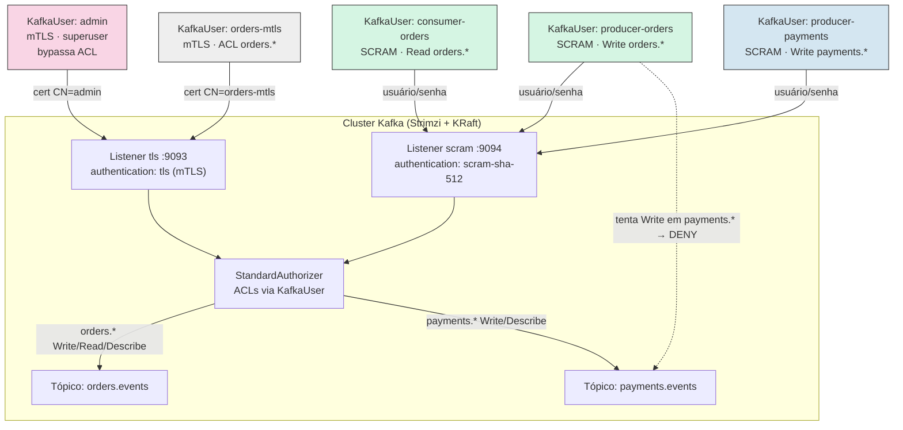
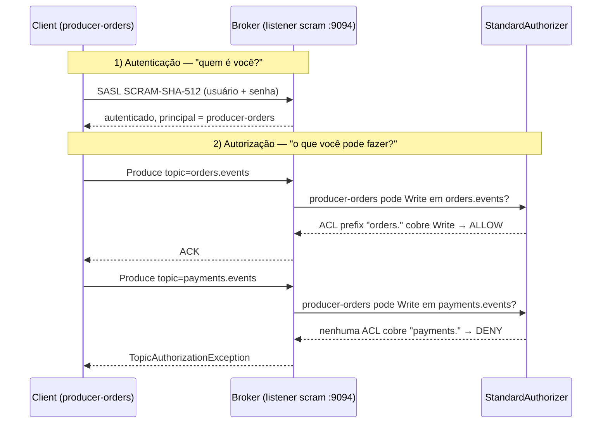

# Autenticação e Autorização no Strimzi — mTLS, SCRAM e ACLs Multi-Tenant

> **Objetivo:** Sair do cluster "aberto" dos Days anteriores e chegar numa configuração de
> **produção**: listeners com TLS obrigatório, dois mecanismos de autenticação (**mTLS** e
> **SCRAM-SHA-512**) coexistindo no mesmo cluster, autorização via **ACLs** com o
> `StandardAuthorizer` nativo do KRaft, e um cenário **multi-tenant** (times `orders` e
> `payments`) isolados por convenção de nome de tópico.

---

## Índice

1. [Contexto](#1-contexto)
2. [Autenticação vs. Autorização — os dois planos](#2-autenticação-vs-autorização--os-dois-planos)
3. [Pré-requisitos](#3-pré-requisitos)
4. [Estrutura do Lab](#4-estrutura-do-lab)
5. [Subindo o Cluster Kind](#5-subindo-o-cluster-kind)
6. [Instalando o Strimzi Cluster Operator](#6-instalando-o-strimzi-cluster-operator)
7. [Deploy: Kafka com Listeners TLS e SCRAM](#7-deploy-kafka-com-listeners-tls-e-scram)
8. [Criando Tópicos e KafkaUsers](#8-criando-tópicos-e-kafkausers)
9. [Extraindo Credenciais das Secrets](#9-extraindo-credenciais-das-secrets)
10. [Testando mTLS com o Usuário `admin`](#10-testando-mtls-com-o-usuário-admin)
11. [Testando SCRAM-SHA-512 com `producer-orders` / `consumer-orders`](#11-testando-scram-sha-512-com-producer-orders--consumer-orders)
12. [mTLS com Usuário Restrito por ACL (Não Superuser)](#12-mtls-com-usuário-restrito-por-acl-não-superuser)
13. [O Teste Negativo: Isolamento Multi-Tenant](#13-o-teste-negativo-isolamento-multi-tenant)
14. [Quotas por Usuário](#14-quotas-por-usuário)
15. [Outras Configs que Valem a Pena Olhar](#15-outras-configs-que-valem-a-pena-olhar)
16. [Cleanup](#16-cleanup)
17. [Referências](#17-referências)

---

## 1. Contexto

Do [Day 1](../Day1-Introducao/) ao [Day 3](../Day3-NodePools-Avancado/) rodamos o Kafka com
listener `plain` (sem TLS, sem autenticação) — perfeito para focar em Node Pools e KRaft sem
ruído, péssimo para qualquer coisa que não seja seu laptop. Neste Day 4 fechamos essa lacuna
com o que todo cluster produtivo precisa:

- **Nenhum listener sem TLS.** Todo tráfego client-facing é criptografado.
- **Dois mecanismos de autenticação no mesmo cluster:** `tls` (mTLS, certificado de
  cliente assinado pela CA do Strimzi) para automação/admin, e `scram-sha-512`
  (usuário/senha) para aplicações — o padrão mais comum em ambientes híbridos, onde nem
  toda aplicação sabe lidar com mTLS mas todas sabem SASL.
- **Autorização granular via ACLs**, gerenciadas declarativamente por `KafkaUser` — sem
  ninguém rodando `kafka-acls.sh` manualmente em produção.
- **Um cenário multi-tenant real:** dois times, `orders` e `payments`, cada um com seus
  próprios tópicos (convenção de prefixo `orders.` / `payments.`) e usuários que só
  enxergam o próprio namespace.

Visão geral do que vamos montar — dois listeners TLS (mecanismos de autenticação
diferentes), um authorizer único decidindo o que cada `KafkaUser` pode fazer, e dois
tenants isolados só por ACL:



## 2. Autenticação vs. Autorização — os dois planos

É comum confundir os dois, mas são camadas independentes e sequenciais:

| Camada | Pergunta que responde | Onde configura no Strimzi |
|---|---|---|
| **Autenticação** | "Quem é você?" | `Kafka.spec.kafka.listeners[].authentication` (tipo de credencial aceita pelo listener) e `KafkaUser.spec.authentication` (tipo de credencial gerada para aquele usuário) |
| **Autorização** | "O que você pode fazer, já sabendo quem você é?" | `Kafka.spec.kafka.authorization` (motor de autorização do cluster) e `KafkaUser.spec.authorization.acls` (regras daquele usuário) |

Um usuário pode se autenticar com sucesso (senha certa, certificado válido) e ainda assim
tomar `TopicAuthorizationException` na primeira operação — autenticação só prova identidade,
quem decide o que essa identidade pode fazer é o **authorizer**.

> **Nota sobre o authorizer:** em `Kafka.spec.kafka.authorization.type: simple`, o Strimzi
> resolve para a implementação nativa correta de acordo com o modo do cluster. Como todo
> cluster Strimzi atual roda em **KRaft** (Zookeeper foi removido na 0.46 — mesma nota que
> fizemos no [Day 1](../Day1-Introducao/)), `type: simple` aqui significa
> `org.apache.kafka.metadata.authorizer.StandardAuthorizer`, o authorizer nativo do Kafka
> que guarda as ACLs no próprio metadata log do KRaft (nada de Zookeeper, nada de
> `AclAuthorizer` legado).

As duas camadas em sequência, com o mesmo request que passa pela autenticação e depois
esbarra (ou não) no authorizer:



## 3. Pré-requisitos

- [Docker](https://docs.docker.com/get-docker/) com pelo menos ~4GB de RAM livres
- [kind](https://kind.sigs.k8s.io/docs/user/quick-start/#installation)
- [kubectl](https://kubernetes.io/docs/tasks/tools/#kubectl)
- `openssl` (opcional, só se quiser inspecionar os certificados gerados)
- Ter feito o [Day 2](../Day2-NodePools/) (assumimos que você já conhece `KafkaNodePool`)

## 4. Estrutura do Lab

```
Day4-Autenticacao-Autorizacao/
├── kind-config.yaml                # cluster kind: 1 control-plane + 2 workers
├── kafka-nodepool-controller.yaml  # KafkaNodePool "controller" (3 réplicas)
├── kafka-nodepool-broker.yaml      # KafkaNodePool "broker" (3 réplicas)
├── kafka-cluster.yaml              # Kafka CR: listeners tls + scram, authorization simple
├── kafka-topic-orders.yaml         # KafkaTopic "orders.events"
├── kafka-topic-payments.yaml       # KafkaTopic "payments.events"
├── kafkauser-admin.yaml            # KafkaUser mTLS, superuser
├── kafkauser-producer-orders.yaml  # KafkaUser SCRAM, Write+Describe em orders.*
├── kafkauser-consumer-orders.yaml  # KafkaUser SCRAM, Read+Describe em orders.* + group
├── kafkauser-producer-payments.yaml# KafkaUser SCRAM, Write+Describe em payments.*
├── kafkauser-orders-mtls.yaml      # KafkaUser mTLS restrito (não superuser), Write+Read+Describe em orders.*
├── README.md
└── README-EN.md
```

## 5. Subindo o Cluster Kind

```bash
kind create cluster --config=kind-config.yaml --name strimzi-day4
kubectl get nodes -o wide
```

## 6. Instalando o Strimzi Cluster Operator

```bash
kubectl create namespace kafka

curl -L https://github.com/strimzi/strimzi-kafka-operator/releases/download/1.1.0/strimzi-cluster-operator-1.1.0.yaml \
  | sed 's/namespace: myproject/namespace: kafka/g' \
  | kubectl create -f - -n kafka

kubectl wait deployment/strimzi-cluster-operator -n kafka --for=condition=Available --timeout=180s
```

## 7. Deploy: Kafka com Listeners TLS e SCRAM

O [`kafka-cluster.yaml`](kafka-cluster.yaml) define dois listeners internos, **ambos com
`tls: true`**, diferindo só no mecanismo de autenticação:

```yaml
listeners:
  - name: tls
    port: 9093
    type: internal
    tls: true
    authentication:
      type: tls          # mTLS — cliente apresenta certificado assinado pela CA do cluster
  - name: scram
    port: 9094
    type: internal
    tls: true
    authentication:
      type: scram-sha-512  # SASL — cliente apresenta usuário/senha
authorization:
  type: simple
  superUsers:
    - CN=admin            # principal de um usuário mTLS é o CN completo do certificado
```

```bash
kubectl apply -f kafka-nodepool-controller.yaml -n kafka
kubectl apply -f kafka-nodepool-broker.yaml -n kafka
kubectl apply -f kafka-cluster.yaml -n kafka

kubectl wait kafka/my-cluster --for=condition=Ready --timeout=300s -n kafka
kubectl get pods -n kafka
```

## 8. Criando Tópicos e KafkaUsers

```bash
kubectl apply -f kafka-topic-orders.yaml -n kafka
kubectl apply -f kafka-topic-payments.yaml -n kafka

kubectl apply -f kafkauser-admin.yaml -n kafka
kubectl apply -f kafkauser-producer-orders.yaml -n kafka
kubectl apply -f kafkauser-consumer-orders.yaml -n kafka
kubectl apply -f kafkauser-producer-payments.yaml -n kafka
kubectl apply -f kafkauser-orders-mtls.yaml -n kafka

kubectl get kafkauser -n kafka
```

Repare que **você não roda `kafka-acls.sh` em nenhum momento**: o `spec.authorization.acls`
de cada `KafkaUser` é lido pelo **User Operator**, que chama a Admin API do Kafka e
reconcilia as ACLs automaticamente — igual ao Topic Operator faz com `KafkaTopic`. Isso é o
que torna esse modelo auditável via GitOps: o estado das permissões vive em YAML versionado,
não em comandos soltos que alguém rodou uma vez.

`producer-orders` tem só `Write` + `Describe` no prefixo `orders.` — sem `Create`. Isso é
proposital: a criação de tópico é responsabilidade do Topic Operator via `KafkaTopic`
([seção 8](#8-criando-tópicos-e-kafkausers) já criou os dois), não da aplicação produtora. Se
sua aplicação depende de `auto.create.topics.enable=true` no client, ela vai precisar também
da operação `Create` — mas isso é um anti-padrão em produção: tópicos criados
implicitamente ficam com config default, sem `min.insync.replicas` nem retenção pensada.

## 9. Extraindo Credenciais das Secrets

O Strimzi cria uma `Secret` com o mesmo nome de cada `KafkaUser`. O conteúdo muda de acordo
com o tipo de autenticação:

| Tipo | Chaves relevantes na Secret |
|---|---|
| `tls` | `ca.crt`, `user.crt`, `user.key`, `user.p12` (keystore PKCS12 pronto), `user.password` |
| `scram-sha-512` | `password`, `sasl.jaas.config` (JAAS **já pronto**, com usuário e senha embutidos) |

E a CA do cluster fica numa Secret separada, criada junto com o `Kafka` CR:

```bash
mkdir -p /tmp/day4-certs && cd /tmp/day4-certs

# Truststore da CA do cluster (serve para validar o servidor em qualquer listener TLS)
kubectl get secret my-cluster-cluster-ca-cert -n kafka -o jsonpath='{.data.ca\.p12}'     | base64 -d > truststore.p12
kubectl get secret my-cluster-cluster-ca-cert -n kafka -o jsonpath='{.data.ca\.password}' | base64 -d > truststore.password

# Keystore do usuário mTLS "admin"
kubectl get secret admin -n kafka -o jsonpath='{.data.user\.p12}'     | base64 -d > admin.p12
kubectl get secret admin -n kafka -o jsonpath='{.data.user\.password}' | base64 -d > admin.password

# Senha do usuário SCRAM "producer-orders"
kubectl get secret producer-orders -n kafka -o jsonpath='{.data.password}' | base64 -d > producer-orders.password
kubectl get secret consumer-orders -n kafka -o jsonpath='{.data.password}' | base64 -d > consumer-orders.password

# Keystore do usuário mTLS restrito por ACL "orders-mtls" (não é superuser)
kubectl get secret orders-mtls -n kafka -o jsonpath='{.data.user\.p12}'     | base64 -d > orders-mtls.p12
kubectl get secret orders-mtls -n kafka -o jsonpath='{.data.user\.password}' | base64 -d > orders-mtls.password
```

## 10. Testando mTLS com o Usuário `admin`

Sobe um pod de trabalho persistente (sem `--rm`, para dar tempo de copiar arquivos com
`kubectl cp`) usando a mesma imagem do Kafka do operator:

```bash
kubectl run kafka-client -n kafka --image=quay.io/strimzi/kafka:1.1.0-kafka-4.3.0 \
  --command -- sleep infinity

kubectl cp /tmp/day4-certs/truststore.p12 kafka-client:/tmp/truststore.p12 -n kafka
kubectl cp /tmp/day4-certs/admin.p12      kafka-client:/tmp/admin.p12      -n kafka
```

Dentro do pod, monta o `client.properties` para mTLS (usa a senha lida em
`admin.password` / `truststore.password`):

```bash
kubectl exec -ti kafka-client -n kafka -- bash -c 'cat > /tmp/admin.properties <<EOF
security.protocol=SSL
ssl.truststore.location=/tmp/truststore.p12
ssl.truststore.password='"$(cat /tmp/day4-certs/truststore.password)"'
ssl.truststore.type=PKCS12
ssl.keystore.location=/tmp/admin.p12
ssl.keystore.password='"$(cat /tmp/day4-certs/admin.password)"'
ssl.keystore.type=PKCS12
EOF'
```

Testa: como `admin` é `superUser`, ele passa por qualquer operação sem checar ACL —
ótimo para validar que a autenticação em si está funcionando antes de mexer com ACLs:

```bash
kubectl exec -ti kafka-client -n kafka -- \
  bin/kafka-topics.sh --bootstrap-server my-cluster-kafka-bootstrap:9093 \
  --command-config /tmp/admin.properties --list
```

Saída esperada:

```
orders.events
payments.events
```

## 11. Testando SCRAM-SHA-512 com `producer-orders` / `consumer-orders`

O grande diferencial do SCRAM aqui: **a Secret já vem com o `sasl.jaas.config` pronto**, sem
você precisar montar a string na mão:

> A imagem `quay.io/strimzi/kafka` usada no `kafka-client` **não tem `kubectl`**, então rodar
> `kubectl get secret` de dentro do pod (via `bash -c`) falha com `kubectl: command not found`.
> Em vez disso, gera o `.properties` localmente (onde `kubectl` e `/tmp/day4-certs/truststore.password`
> já existem, da seção 9) e manda pro pod com `kubectl cp` — mesmo fluxo que usamos pros `.p12`,
> e sem a dor de cabeça de escapar aspas dentro de aspas.

```bash
JAAS=$(kubectl get secret producer-orders -n kafka -o jsonpath='{.data.sasl\.jaas\.config}' | base64 -d)
TRUSTSTORE_PASS=$(cat /tmp/day4-certs/truststore.password)

cat > /tmp/day4-certs/producer-orders.properties <<EOF
security.protocol=SASL_SSL
sasl.mechanism=SCRAM-SHA-512
sasl.jaas.config=$JAAS
ssl.truststore.location=/tmp/truststore.p12
ssl.truststore.password=$TRUSTSTORE_PASS
ssl.truststore.type=PKCS12
EOF

kubectl cp /tmp/day4-certs/producer-orders.properties kafka-client:/tmp/producer-orders.properties -n kafka
```

Repete o mesmo processo para `consumer-orders.properties`, trocando o nome do usuário no
`jsonpath` (e no `kubectl cp` de destino):

```bash
JAAS=$(kubectl get secret consumer-orders -n kafka -o jsonpath='{.data.sasl\.jaas\.config}' | base64 -d)
TRUSTSTORE_PASS=$(cat /tmp/day4-certs/truststore.password)

cat > /tmp/day4-certs/consumer-orders.properties <<EOF
security.protocol=SASL_SSL
sasl.mechanism=SCRAM-SHA-512
sasl.jaas.config=$JAAS
ssl.truststore.location=/tmp/truststore.p12
ssl.truststore.password=$TRUSTSTORE_PASS
ssl.truststore.type=PKCS12
EOF

kubectl cp /tmp/day4-certs/consumer-orders.properties kafka-client:/tmp/consumer-orders.properties -n kafka
```

Com os dois arquivos no pod:

**Produzir em `orders.events` (permitido):**

```bash
kubectl exec -ti kafka-client -n kafka -- \
  bin/kafka-console-producer.sh --bootstrap-server my-cluster-kafka-bootstrap:9094 \
  --topic orders.events --producer.config /tmp/producer-orders.properties
```

**Consumir de `orders.events` (permitido, grupo `orders-consumer-checkout`, que casa com
o prefixo `orders-consumer-` liberado para esse usuário):**

```bash
kubectl exec -ti kafka-client -n kafka -- \
  bin/kafka-console-consumer.sh --bootstrap-server my-cluster-kafka-bootstrap:9094 \
  --topic orders.events --group orders-consumer-checkout --from-beginning \
  --consumer.config /tmp/consumer-orders.properties
```

As mensagens digitadas no producer devem aparecer no consumer, exatamente como nos Days
anteriores — só que agora passando por TLS + SASL de ponta a ponta.

## 12. mTLS com Usuário Restrito por ACL (Não Superuser)

O exemplo de mTLS da [seção 10](#10-testando-mtls-com-o-usuário-admin) usa o usuário `admin`,
que é `superUser` — ele passa por qualquer operação sem o authorizer nem consultar ACL, então
aquele teste prova que a **autenticação** mTLS funciona, mas nada diz sobre **autorização**.
Este segundo exemplo fecha essa lacuna: mesmo mecanismo de autenticação (`type: tls`,
certificado assinado pela CA do cluster, keystore PKCS12), só que para um usuário comum, com
ACLs tão restritas quanto as de `producer-orders`/`consumer-orders` na seção anterior. A
diferença entre este `KafkaUser` e os SCRAM da seção 11 é **só o mecanismo de autenticação** —
a autorização (o bloco `acls`) é conceitualmente idêntica.

[`kafkauser-orders-mtls.yaml`](kafkauser-orders-mtls.yaml):

```yaml
apiVersion: kafka.strimzi.io/v1
kind: KafkaUser
metadata:
  name: orders-mtls
  labels:
    strimzi.io/cluster: my-cluster
spec:
  authentication:
    type: tls            # mesmo mecanismo do admin, mas sem entrar em spec.kafka.authorization.superUsers
  authorization:
    type: simple
    acls:
      - resource:
          type: topic
          name: orders.
          patternType: prefix
        operations:
          - Write
          - Read
          - Describe
      - resource:
          type: group
          name: orders-consumer-
          patternType: prefix
        operations:
          - Read
```

Copia o keystore (extraído na seção 9) para o pod:

```bash
kubectl cp /tmp/day4-certs/orders-mtls.p12 kafka-client:/tmp/orders-mtls.p12 -n kafka
```

Monta o `client.properties` — mesma estrutura da seção 10 (`security.protocol=SSL`, par
keystore + truststore), só trocando o keystore e a senha para os desse usuário:

```bash
kubectl exec -ti kafka-client -n kafka -- bash -c 'cat > /tmp/orders-mtls.properties <<EOF
security.protocol=SSL
ssl.truststore.location=/tmp/truststore.p12
ssl.truststore.password='"$(cat /tmp/day4-certs/truststore.password)"'
ssl.truststore.type=PKCS12
ssl.keystore.location=/tmp/orders-mtls.p12
ssl.keystore.password='"$(cat /tmp/day4-certs/orders-mtls.password)"'
ssl.keystore.type=PKCS12
EOF'
```

**Produzir em `orders.events` pelo listener `tls` (porta 9093 — o mesmo do `admin`),
permitido pela ACL:**

```bash
kubectl exec -ti kafka-client -n kafka -- \
  bin/kafka-console-producer.sh --bootstrap-server my-cluster-kafka-bootstrap:9093 \
  --topic orders.events --producer.config /tmp/orders-mtls.properties
```

**Consumir de `orders.events`, permitido:**

```bash
kubectl exec -ti kafka-client -n kafka -- \
  bin/kafka-console-consumer.sh --bootstrap-server my-cluster-kafka-bootstrap:9093 \
  --topic orders.events --group orders-consumer-mtls --from-beginning \
  --consumer.config /tmp/orders-mtls.properties
```

**Teste negativo — produzir em `payments.events` com o mesmo certificado:**

```bash
kubectl exec -ti kafka-client -n kafka -- \
  bin/kafka-console-producer.sh --bootstrap-server my-cluster-kafka-bootstrap:9093 \
  --topic payments.events --producer.config /tmp/orders-mtls.properties
```

Saída esperada:

```
[ERROR] Error when sending message to topic payments.events with key: null, value: 5 bytes with error:
org.apache.kafka.common.errors.TopicAuthorizationException: Not authorized to access topics: [payments.events]
```

O mesmo erro visto na [seção 13](#13-o-teste-negativo-isolamento-multi-tenant) com
`producer-orders`, só que agora o principal negado vem do CN do certificado
(`CN=orders-mtls`) em vez de usuário/senha SCRAM. Isso prova que o `StandardAuthorizer` trata
os dois mecanismos de autenticação exatamente da mesma forma: o que importa para a ACL é o
**principal** resultante, não como ele chegou até ali.

> **Por que isso importa:** é comum achar que "mTLS = acesso irrestrito", porque o primeiro
> exemplo de mTLS que a maioria vê usa um certificado de admin/superuser. Este `orders-mtls`
> mostra que mTLS é só o mecanismo de **autenticação**; a autorização continua sendo uma
> decisão separada e independente do authorizer, igual a qualquer outro mecanismo — inclusive
> reaproveitável com o mesmo par keystore/truststore PKCS12 que qualquer client Java/Kafka já
> sabe consumir, sem depender de bibliotecas SASL.

## 13. O Teste Negativo: Isolamento Multi-Tenant

Essa é a parte que realmente prova que a autorização está funcionando: **tentar fazer algo
que o usuário não deveria poder fazer.**

`producer-orders` só tem ACL para o prefixo `orders.`. Vamos tentar produzir em
`payments.events` com as credenciais dele:

```bash
kubectl exec -ti kafka-client -n kafka -- \
  bin/kafka-console-producer.sh --bootstrap-server my-cluster-kafka-bootstrap:9094 \
  --topic payments.events --producer.config /tmp/producer-orders.properties
```

Saída esperada (o producer recusa a mensagem e o client loga o erro, sem derrubar o
processo — ele fica retentando até o `delivery.timeout.ms` estourar):

```
[ERROR] Error when sending message to topic payments.events with key: null, value: 5 bytes with error:
org.apache.kafka.common.errors.TopicAuthorizationException: Not authorized to access topics: [payments.events]
```

Isso é o `StandardAuthorizer` negando a operação `Write` no resource `payments.events`
para o principal `producer-orders` — a mesma checagem, no mesmo authorizer, que liberou a
operação equivalente em `orders.events` na seção anterior. Repita o teste trocando para
`producer-payments.properties` (gerado do jeito da seção 9/11) contra `orders.events`: o
resultado é o mesmo erro, na direção oposta. **Isso é isolamento multi-tenant de verdade** —
sem precisar de clusters Kafka separados por time, sem precisar de namespaces de rede
diferentes, só ACL.

## 14. Quotas por Usuário

Repare que `producer-orders` e `consumer-orders` têm um bloco `quotas` no `KafkaUser`:

```yaml
quotas:
  producerByteRate: 1048576   # ~1 MB/s
  requestPercentage: 25       # no máximo 25% do tempo de request handler threads
```

Isso também é reconciliado pelo User Operator via Admin API — e você pode conferir o
resultado com `kafka-configs.sh` usando as credenciais do `admin`:

```bash
kubectl exec -ti kafka-client -n kafka -- \
  bin/kafka-configs.sh --bootstrap-server my-cluster-kafka-bootstrap:9093 \
  --command-config /tmp/admin.properties \
  --describe --entity-type users --entity-name producer-orders
```

Saída esperada:

```
Quota configs for user-principal 'producer-orders' are producer_byte_rate=1048576.0,request_percentage=25.0
```

Em produção, isso é o que separa "um tenant barulhento" de "um incidente": sem quota, um
producer com bug (retry loop, batch mal configurado) pode saturar a banda de I/O dos
brokers e derrubar a latência de **todos** os outros tenants do cluster. Com a quota, o
próprio broker throttla as respostas daquele client — ele fica lento, o resto do cluster
não sente.

## 15. Outras Configs que Valem a Pena Olhar

Fica de gancho para explorar (e para os próximos vídeos da série):

- **`KafkaUser.spec.authorization.acls[].host`** — por padrão as ACLs valem para qualquer
  host (`*`); dá pra restringir por IP de origem em cenários onde isso faz sentido.
- **Prefixed vs. Literal patternType** — usamos `prefix` para todo o multi-tenant; `literal`
  é mais estrito (nome exato) e útil para tópicos "especiais" (ex: `__consumer_offsets`).
- **OAuth 2.0 / OIDC** (`authentication.type: oauth`) — para integrar com um Identity
  Provider corporativo (Keycloak, Azure AD) em vez de gerenciar segredos SCRAM/TLS
  diretamente no cluster.
- **`KafkaUser.spec.authorization.type: opa`** — delega a decisão de autorização para um
  servidor **Open Policy Agent** externo, útil quando a política de acesso precisa ser
  compartilhada entre Kafka e outros sistemas.
- **mTLS externo (listener `type: route`/`loadbalancer` com `tls: true`)** — este lab manteve
  os listeners `internal` por simplicidade; expor um listener autenticado para fora do
  cluster segue exatamente o mesmo modelo, só muda o `type`.

## 16. Cleanup

```bash
kubectl delete pod kafka-client -n kafka
kubectl -n kafka delete $(kubectl get strimzi -o name -n kafka)
kubectl get pvc -n kafka   # devem sumir sozinhas por causa do deleteClaim: true
kind delete cluster --name strimzi-day4
rm -rf /tmp/day4-certs
```

## 17. Referências

| Recurso | URL |
|---|---|
| Strimzi — Securing Kafka (autenticação) | https://strimzi.io/docs/operators/latest/deploying#assembly-securing-kafka-str |
| Strimzi — KafkaUser API Reference | https://strimzi.io/docs/operators/latest/configuring#type-KafkaUser-reference |
| Strimzi — Managing Authorization | https://strimzi.io/docs/operators/latest/deploying#con-securing-kafka-authorization-str |
| Kafka — Authorization and ACLs | https://kafka.apache.org/documentation/#security_authz |
| Kafka — Quotas | https://kafka.apache.org/documentation/#design_quotas |
| Release usada neste lab (1.1.0) | https://github.com/strimzi/strimzi-kafka-operator/releases/tag/1.1.0 |

---

> Parte da série **Espetinho de Kafka** — Strimzi Day 4: Autenticação e Autorização.
> Próximo Day: [Cruise Control](../Day5-CruiseControl/) — rebalanceamento automático e
> self-healing de partições entre brokers.
