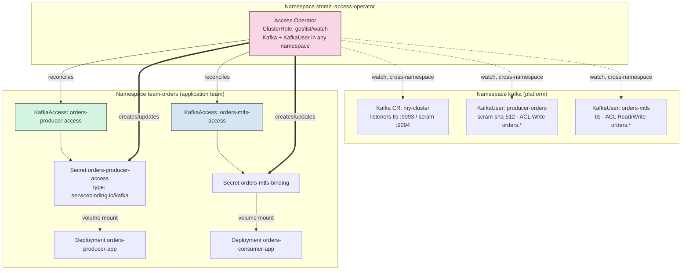
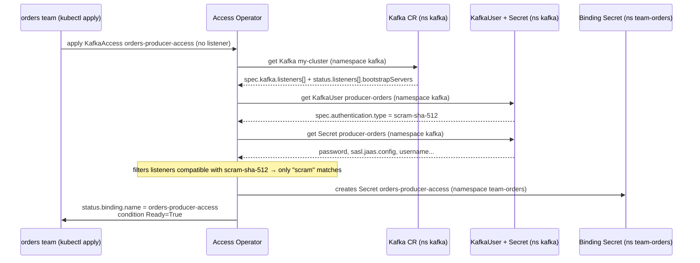

# Kafka Access Operator — Service Binding and Cross-Namespace Access Without Copying Secrets

> **Goal:** Close the gap [Day 4](../Day4-Autenticacao-Autorizacao/) left open on purpose:
> back there, for an app to consume a `KafkaUser`, someone had to run
> `kubectl get secret ... -o jsonpath` by hand, Base64-decode it, build a `client.properties`
> file, and copy everything into a Pod. In this Day 5 we install the
> **[Strimzi Access Operator](https://github.com/strimzi/kafka-access-operator)** — which
> watches a `Kafka` and a `KafkaUser` (in any namespace) and materializes a single `Secret`,
> in the standard **Service Binding Specification** format, inside the namespace of whoever
> actually consumes it. We test this with a real app (a `Deployment`, not a debug pod)
> running in a namespace separate from the Kafka cluster's — the closest thing to a
> multi-team production scenario you can build on a laptop.

---

## Table of Contents

1. [Context](#1-context)
2. [What the Kafka Access Operator Is](#2-what-the-kafka-access-operator-is)
3. [Prerequisites](#3-prerequisites)
4. [Lab Structure](#4-lab-structure)
5. [Bringing Up the Kind Cluster](#5-bringing-up-the-kind-cluster)
6. [Installing the Strimzi Cluster Operator](#6-installing-the-strimzi-cluster-operator)
7. [Deploy: Kafka, Topic and KafkaUsers](#7-deploy-kafka-topic-and-kafkausers)
8. [Installing the Kafka Access Operator](#8-installing-the-kafka-access-operator)
9. [The First KafkaAccess: Cross-Namespace SCRAM Binding](#9-the-first-kafkaaccess-cross-namespace-scram-binding)
10. [Dissecting the Generated Secret](#10-dissecting-the-generated-secret)
11. [Running a Real Application on Top of the Binding](#11-running-a-real-application-on-top-of-the-binding)
12. [Second KafkaAccess: mTLS, Custom Secret and Annotation Template](#12-second-kafkaaccess-mtls-custom-secret-and-annotation-template)
13. [The Negative Test: Incompatible Listener and Authentication](#13-the-negative-test-incompatible-listener-and-authentication)
14. [End-to-End Credential Rotation](#14-end-to-end-credential-rotation)
15. [Cross-Namespace in Practice: What It Changes About RBAC](#15-cross-namespace-in-practice-what-it-changes-about-rbac)
16. [Other Configs Worth Exploring](#16-other-configs-worth-exploring)
17. [Cleanup](#17-cleanup)
18. [References](#18-references)

---

## 1. Context

In [Day 4](../Day4-Autenticacao-Autorizacao/) we created `KafkaUser`s with mTLS and SCRAM,
prefix ACLs, quotas — and to prove it all worked, we extracted credentials like this:

```bash
kubectl get secret producer-orders -n kafka -o jsonpath='{.data.sasl\.jaas\.config}' | base64 -d
kubectl get secret admin -n kafka -o jsonpath='{.data.user\.p12}' | base64 -d > admin.p12
```

That's perfectly reasonable **to learn what's inside the Secret**. In production it's a
different story:

- To run those commands, someone (or a CI/CD pipeline) needs `get` permission on `Secret`
  **in the Kafka cluster's namespace** — which usually belongs to the platform team, not the
  application team. Either you grant that access (widening the blast radius of who can read
  any secret in that namespace), or someone on the platform team becomes a bottleneck,
  manually copying Secrets every time a new team needs access.
- Each authentication type has a different Secret shape (`user.p12` + password for mTLS,
  a ready-made `sasl.jaas.config` for SCRAM) — whoever consumes it needs to know how to build
  `client.properties` for each one.
- Nothing re-syncs automatically. If the SCRAM password rotates or the mTLS certificate is
  renewed, the `client.properties` you manually copied into the Pod goes stale until someone
  remembers to redo the whole process.

The **Access Operator** exists exactly for this: it creates a single, complete `Secret`
(bootstrap servers, security protocol, credential — whatever applies) in a namespace of your
choosing, whenever you declare a `KafkaAccess` object. No application team needs RBAC to read
Secrets in the Kafka namespace; the operator already has that permission (via a
`ClusterRole`) and does the copy — with the right shape — for you.



## 2. What the Kafka Access Operator Is

The [Access Operator](https://github.com/strimzi/kafka-access-operator) is a **separate**
project from the Strimzi Cluster Operator (its own repository, its own release — we use
`0.3.0` in this lab). It does not manage the Kafka cluster or create `KafkaUser`s; it only
**reads** an existing `Kafka` and `KafkaUser` and **materializes** a connection `Secret` from
them, following the [Service Binding Specification for Kubernetes v1.0.0](https://servicebinding.io/spec/core/1.0.0/)
convention — a standard several languages/frameworks already know how to consume (Spring
Cloud Bindings, Quarkus, Node/Python binding libraries). Here we consume it by hand so it's
crystal clear what's inside.

| Custom Resource | Created by | Purpose |
|---|---|---|
| `Kafka` / `KafkaUser` | Strimzi Cluster Operator (Days 1–4) | The cluster and its credentials |
| `KafkaAccess` | **You**, in the consumer's namespace | Asks the Access Operator to materialize the binding |
| `Secret` (`type: servicebinding.io/kafka`) | Access Operator | The result: everything the app needs to connect, in one object |

The `KafkaAccess` CRD (`access.strimzi.io/v1alpha1`) is **namespaced** — each `KafkaAccess`
lives in a specific namespace, just like any other Kubernetes object. What enables
cross-namespace access isn't the CRD itself, but the operator's `ClusterRole`: it has
`get/list/watch` on `kafkas` and `kafkausers` **across the whole cluster**, so a
`KafkaAccess` in namespace `team-orders` can perfectly well point to a `Kafka` and a
`KafkaUser` living in namespace `kafka` — via `spec.kafka.namespace` and
`spec.user.namespace`. Without those two fields, the operator assumes the `KafkaAccess`'s own
namespace (which would only work if everything lived together).

Listener selection rules when `spec.kafka.listener` isn't specified (straight from the
operator's source code, `KafkaParser`):

1. Only one listener in the `Kafka` CR → that one is used.
2. Several listeners → filter by those whose `authentication.type` is compatible with the
   referenced `KafkaUser` (`tls` matches `tls`/`tls-external`; `scram-sha-512` matches only
   `scram-sha-512`; with no `KafkaUser`, any listener works).
3. Still more than one candidate → prefer `type: internal`.
4. Still tied → sort alphabetically by name and take the first one.

And if you **do specify** a listener that doesn't match the `KafkaUser`'s authentication, the
operator doesn't improvise — it refuses, and marks the `KafkaAccess` as not ready (section
13).

## 3. Prerequisites

- [Docker](https://docs.docker.com/get-docker/) with at least ~4GB of free RAM
- [kind](https://kind.sigs.k8s.io/docs/user/quick-start/#installation)
- [kubectl](https://kubernetes.io/docs/tasks/tools/#kubectl)
- Have completed [Day 4](../Day4-Autenticacao-Autorizacao/) (we assume you already know
  `KafkaUser`, ACLs, and the difference between `tls` and `scram-sha-512` authentication)

## 4. Lab Structure

```
Day5-KafkaAccessOperator/
├── kind-config.yaml                 # kind cluster: 1 control-plane + 2 workers
├── kafka-nodepool-controller.yaml   # KafkaNodePool "controller" (3 replicas)
├── kafka-nodepool-broker.yaml       # KafkaNodePool "broker" (3 replicas)
├── kafka-cluster.yaml               # Kafka CR: tls + scram listeners, simple authorization
├── kafka-topic-orders.yaml          # KafkaTopic "orders.events"
├── kafkauser-producer-orders.yaml   # SCRAM KafkaUser, Write+Describe on orders.*
├── kafkauser-orders-mtls.yaml       # mTLS KafkaUser, Read+Write+Describe on orders.*
├── namespace-team-orders.yaml       # Separate namespace owning the application
├── kafkaaccess-orders-scram.yaml    # Cross-namespace KafkaAccess, automatic listener
├── kafkaaccess-orders-mtls.yaml     # mTLS KafkaAccess, secretName + annotation template
├── kafkaaccess-mismatch.yaml        # KafkaAccess with incompatible listener/auth (negative test)
├── app-producer-deployment.yaml     # Deployment consuming the SCRAM binding via volume
├── app-consumer-deployment.yaml     # Deployment consuming the mTLS binding via volume
├── README.md
└── README-EN.md
```

## 5. Bringing Up the Kind Cluster

```bash
kind create cluster --config=kind-config.yaml --name strimzi-day5
kubectl get nodes -o wide
```

## 6. Installing the Strimzi Cluster Operator

Same version as Day 4 (`1.1.0`), same process:

```bash
kubectl create namespace kafka

curl -L https://github.com/strimzi/strimzi-kafka-operator/releases/download/1.1.0/strimzi-cluster-operator-1.1.0.yaml \
  | sed 's/namespace: myproject/namespace: kafka/g' \
  | kubectl create -f - -n kafka

kubectl wait deployment/strimzi-cluster-operator -n kafka --for=condition=Available --timeout=180s
```

## 7. Deploy: Kafka, Topic and KafkaUsers

[`kafka-cluster.yaml`](kafka-cluster.yaml) reuses the Day 4 baseline — two TLS listeners
(`tls` for mTLS, `scram` for SASL), `authorization.type: simple` (which resolves to KRaft's
native `StandardAuthorizer`). The one difference: we don't need `superUsers` in this lab,
because we're not running any administrative command — everything here goes through the
normal ACLs of the two `KafkaUser`s.

```bash
kubectl apply -f kafka-nodepool-controller.yaml -n kafka
kubectl apply -f kafka-nodepool-broker.yaml -n kafka
kubectl apply -f kafka-cluster.yaml -n kafka

kubectl wait kafka/my-cluster --for=condition=Ready --timeout=300s -n kafka
kubectl get pods -n kafka
```

The topic and the two `KafkaUser`s ([`kafkauser-producer-orders.yaml`](kafkauser-producer-orders.yaml),
[`kafkauser-orders-mtls.yaml`](kafkauser-orders-mtls.yaml)) — identical to Day 4's:

```bash
kubectl apply -f kafka-topic-orders.yaml -n kafka
kubectl apply -f kafkauser-producer-orders.yaml -n kafka
kubectl apply -f kafkauser-orders-mtls.yaml -n kafka

kubectl wait kafkauser/producer-orders -n kafka --for=condition=Ready --timeout=60s
kubectl wait kafkauser/orders-mtls -n kafka --for=condition=Ready --timeout=60s
```

At this point the cluster looks exactly like Day 4's end state: two `KafkaUser`s ready, each
with its own `Secret` in the `kafka` namespace. **We haven't touched either of them yet** —
that's exactly what the Access Operator is about to do for us, without ever running
`kubectl get secret -o jsonpath` a single time.

## 8. Installing the Kafka Access Operator

The Access Operator is a separate project from the Strimzi Cluster Operator, with its own
release. The install manifests ship inside the release's `.tar.gz` (there's no single
all-in-one YAML like the cluster operator has):

```bash
curl -L https://github.com/strimzi/kafka-access-operator/releases/download/0.3.0/strimzi-access-operator-0.3.0.tar.gz \
  | tar xz

kubectl apply -f strimzi-access-operator-0.3.0/install
```

This creates, among other things:

| Manifest | What it does |
|---|---|
| `000-Namespace.yaml` | Creates the `strimzi-access-operator` namespace |
| `010-ServiceAccount.yaml` | The operator's ServiceAccount |
| `020-ClusterRole.yaml` | `get/list/watch` on `kafkas` and `kafkausers` (**any namespace**); full CRUD on `kafkaaccesses` and `Secret` |
| `030-ClusterRoleBinding.yaml` | Binds the `ClusterRole` to the `ServiceAccount` — cluster-wide |
| `040-Crd-kafkaaccess.yaml` | The `KafkaAccess` CRD (`access.strimzi.io/v1alpha1`, `scope: Namespaced`) |
| `050-Deployment.yaml` | The operator's Deployment (`quay.io/strimzi/access-operator:0.3.0`) |

> **Why a `ClusterRole` and not a `Role`:** it's exactly this `ClusterRole` (cluster-scoped
> RBAC, not namespace-scoped) that lets the operator read a `Kafka` and a `KafkaUser` that
> live in a different namespace than the `KafkaAccess` referencing them. Without it,
> cross-namespace binding simply wouldn't be possible — we go deeper on this in
> [section 15](#15-cross-namespace-in-practice-what-it-changes-about-rbac).

```bash
kubectl wait deployment/strimzi-access-operator -n strimzi-access-operator \
  --for=condition=Available --timeout=120s

kubectl get pods -n strimzi-access-operator
kubectl get crd kafkaaccesses.access.strimzi.io
```

## 9. The First KafkaAccess: Cross-Namespace SCRAM Binding

Before creating the `KafkaAccess`, we create the namespace representing the consuming
team — **deliberately separate** from the `kafka` namespace:

```bash
kubectl apply -f namespace-team-orders.yaml
```

[`kafkaaccess-orders-scram.yaml`](kafkaaccess-orders-scram.yaml):

```yaml
apiVersion: access.strimzi.io/v1alpha1
kind: KafkaAccess
metadata:
  name: orders-producer-access
spec:
  kafka:
    name: my-cluster
    namespace: kafka        # the cluster lives in a namespace other than the KafkaAccess's
  user:
    kind: KafkaUser
    apiGroup: kafka.strimzi.io
    name: producer-orders
    namespace: kafka        # so does the KafkaUser
```

Notice we **don't specify `spec.kafka.listener`**. Since we only reference a
`scram-sha-512` `KafkaUser`, the operator filters the cluster's two listeners and only
`scram` matches — rule 2 of the automatic selection described in
[section 2](#2-what-the-kafka-access-operator-is).

```bash
kubectl apply -f kafkaaccess-orders-scram.yaml -n team-orders

kubectl get kafkaaccess -n team-orders
kubectl wait kafkaaccess/orders-producer-access -n team-orders \
  --for=condition=Ready --timeout=60s
```

Expected output from `kubectl get kafkaaccess -n team-orders` (columns come from the CRD's
`additionalPrinterColumns`):

```
NAME                      LISTENER   CLUSTER      USER              READY
orders-producer-access               my-cluster   producer-orders   True
```

The `LISTENER` column shows up empty because we never specified it in the CR — but the
generated Secret (next section) shows the operator resolved it to the `scram` listener
anyway. Confirm with:

```bash
kubectl get kafkaaccess orders-producer-access -n team-orders -o jsonpath='{.status}' | jq .
```

```json
{
  "binding": { "name": "orders-producer-access" },
  "conditions": [
    { "type": "Ready", "status": "True", "reason": "Ready", "message": "Ready" }
  ],
  "observedGeneration": 1
}
```

`status.binding.name` is the name of the `Secret` that was created — by default, **the same
as the `KafkaAccess`'s own name** (it only differs if you set `spec.secretName`, which we do
in the second example, [section 12](#12-second-kafkaaccess-mtls-custom-secret-and-annotation-template)).

The full reconciliation flow, from `kubectl apply` to a ready `Secret`:



## 10. Dissecting the Generated Secret

```bash
kubectl get secret orders-producer-access -n team-orders -o json \
  | jq -r '.data | to_entries[] | "\(.key)=\(.value | @base64d)"'
```

Output (values truncated/illustrative):

```
type=kafka
provider=strimzi
bootstrap.servers=my-cluster-kafka-bootstrap.kafka.svc:9094
bootstrap-servers=my-cluster-kafka-bootstrap.kafka.svc:9094
bootstrapServers=my-cluster-kafka-bootstrap.kafka.svc:9094
security.protocol=SASL_SSL
securityProtocol=SASL_SSL
ssl.truststore.crt=-----BEGIN CERTIFICATE-----\n...
username=producer-orders
user=producer-orders
sasl.mechanism=SCRAM-SHA-512
saslMechanism=SCRAM-SHA-512
password=************
sasl.jaas.config=org.apache.kafka.common.security.scram.ScramLoginModule required username="producer-orders" password="************";
```

A few details worth understanding (straight from the operator's source code —
`SecretDependentResource`, `KafkaListener` and `KafkaUserData`):

- **The same information appears under 2 or 3 key-naming conventions.**
  `bootstrap.servers` (the "Kafka property" style, with a dot), `bootstrap-servers` (the
  hyphenated one Spring Boot expects) and `bootstrapServers` (camelCase, what Quarkus
  expects). Same goes for `security.protocol`/`securityProtocol` and
  `sasl.mechanism`/`saslMechanism`. This exists so **different frameworks can consume the
  same `Secret` with zero transformation** — each Service Binding framework already knows
  which convention to look for.
- **`ssl.truststore.crt` only shows up because the chosen listener is TLS.** If the cluster
  had a listener without TLS, that key simply wouldn't exist in the Secret.
- **`sasl.jaas.config` already comes ready to use as a Java property value**, just like you
  saw in Day 4 straight from the `KafkaUser`'s own Secret — the operator just copies that
  specific key over from the original Secret.
- The whole `Secret` has `type: servicebinding.io/kafka` and the label
  `app.kubernetes.io/managed-by: kafka-access-operator` — you can list every binding managed
  in the cluster with `kubectl get secrets -A -l app.kubernetes.io/managed-by=kafka-access-operator`.

## 11. Running a Real Application on Top of the Binding

This is the core of the lab: an application running in the `team-orders` namespace — which
**never** had read access to the `kafka` namespace — publishes real messages to
`orders.events` using only the `Secret` the Access Operator generated.

The Service Binding Specification requires the `Secret` to be **mounted as a volume**, not
read via `envFrom` — and that makes sense: several keys have dots in their names
(`sasl.jaas.config`, `bootstrap.servers`), which is invalid as a Kubernetes environment
variable name (Kubernetes silently drops, with a warning event, any `envFrom` key that isn't
a valid C identifier). As a **file**, the key name becomes the file name — dots aren't a
problem at all.

[`app-producer-deployment.yaml`](app-producer-deployment.yaml) mounts the Secret at
`/bindings/kafka` and uses an entrypoint script that reads those files and builds
`client.properties` on the fly — the same job a Service Binding library (Spring Cloud
Bindings, Quarkus) would do for you automatically:

```yaml
volumes:
  - name: kafka-binding
    secret:
      secretName: orders-producer-access
containers:
  - name: producer
    volumeMounts:
      - name: kafka-binding
        mountPath: /bindings/kafka
        readOnly: true
    command: ["/bin/bash", "-c"]
    args:
      - |
        BIND=/bindings/kafka
        cat > /tmp/client.properties <<EOF
        security.protocol=$(cat "$BIND/security.protocol")
        sasl.mechanism=$(cat "$BIND/sasl.mechanism")
        sasl.jaas.config=$(cat "$BIND/sasl.jaas.config")
        ssl.truststore.type=PEM
        ssl.truststore.location=$BIND/ssl.truststore.crt
        EOF
        BOOTSTRAP=$(cat "$BIND/bootstrap.servers")
        # ...production loop, see the full file
```

```bash
kubectl apply -f app-producer-deployment.yaml -n team-orders
kubectl rollout status deployment/orders-producer-app -n team-orders --timeout=90s
kubectl logs -f deployment/orders-producer-app -n team-orders
```

Expected output (logs every 5s):

```
Conectando em my-cluster-kafka-bootstrap.kafka.svc:9094 como producer-orders
>>
```

Confirming the messages actually land in the topic comes in the next section, when we bring
up the consumer `Deployment` — which uses a **different** binding (mTLS), from a different
`KafkaUser`, mounted from a different `KafkaAccess`. Two applications, two different origin
namespaces for the credential, the same topic.

> **What this test proves:** the `orders` team never ran `kubectl get secret` in the `kafka`
> namespace, never needed to know `producer-orders` uses SCRAM, nor how to build a JAAS
> config. It just applied a 10-line `KafkaAccess` in its own namespace and mounted the
> resulting `Secret` like any other — exactly as it would with a binding created by, say, an
> RDS operator for a database.

## 12. Second KafkaAccess: mTLS, Custom Secret and Annotation Template

[`kafkaaccess-orders-mtls.yaml`](kafkaaccess-orders-mtls.yaml) uses the mTLS `KafkaUser`
(`orders-mtls`) and exercises two fields we didn't use in the first example:

```yaml
apiVersion: access.strimzi.io/v1alpha1
kind: KafkaAccess
metadata:
  name: orders-mtls-access
spec:
  kafka:
    name: my-cluster
    namespace: kafka
    listener: tls
  user:
    kind: KafkaUser
    apiGroup: kafka.strimzi.io
    name: orders-mtls
    namespace: kafka
  secretName: orders-mtls-binding      # custom name instead of the default (the CR's name)
  template:
    secret:
      metadata:
        annotations:
          reloader.stakater.com/match: "true"
        labels:
          team: orders
```

- **`secretName`** — without this field, the Secret would be called `orders-mtls-access`
  (same as the CR). With it, it's called `orders-mtls-binding`. Handy when several
  `KafkaAccess` CRs need to converge on a Secret name an application already expects by its
  own convention.
- **`template.secret.metadata`** (annotations/labels) — a `0.3.0` release feature. Any
  annotation or label here gets merged into the generated Secret, **without overwriting**
  what's already there (the operator merges while preserving existing content). We use this
  to mark the Secret with `reloader.stakater.com/match: "true"`, the annotation the
  [Stakater Reloader](https://github.com/stakater/Reloader) uses to know which Secrets to
  watch — we close that loop in [section 14](#14-end-to-end-credential-rotation).

```bash
kubectl apply -f kafkaaccess-orders-mtls.yaml -n team-orders
kubectl wait kafkaaccess/orders-mtls-access -n team-orders --for=condition=Ready --timeout=60s

kubectl get secret orders-mtls-binding -n team-orders \
  -o jsonpath='{.metadata.annotations}' | jq .
```

The mTLS Secret carries `ssl.keystore.crt` and `ssl.keystore.key` — **raw PEM**, not the
`user.p12` (PKCS12) we manually extracted in Day 4. That's intentional: since
[KIP-651](https://cwiki.apache.org/confluence/display/KAFKA/KIP-651+-+Support+PEM+format+for+SSL+certificates+and+private+key)
(Kafka 2.7+), the Kafka client reads certificate and key PEM **directly**, with no
intermediate keystore and no keystore password:

```properties
ssl.keystore.type=PEM
ssl.keystore.location=/tmp/keystore.pem   # file with CERTIFICATE + PRIVATE KEY concatenated
```

[`app-consumer-deployment.yaml`](app-consumer-deployment.yaml) does exactly that —
concatenates the two files mounted from the binding into a single PEM file and points
`ssl.keystore.location` at it:

```bash
cat "$BIND/ssl.keystore.crt" "$BIND/ssl.keystore.key" > /tmp/keystore.pem
```

```bash
kubectl apply -f app-consumer-deployment.yaml -n team-orders
kubectl rollout status deployment/orders-consumer-app -n team-orders --timeout=90s
kubectl logs -f deployment/orders-consumer-app -n team-orders
```

The messages the `orders-producer-app` is publishing (section 11) should show up here —
two `Deployment`s, two different authentication mechanisms (SCRAM and mTLS), two different
binding `Secret`s, **neither one** ever touching the `kafka` namespace.

## 13. The Negative Test: Incompatible Listener and Authentication

[`kafkaaccess-mismatch.yaml`](kafkaaccess-mismatch.yaml) references the `tls` (mTLS)
listener but points at the `producer-orders` `KafkaUser`, which is `scram-sha-512`:

```yaml
spec:
  kafka:
    name: my-cluster
    namespace: kafka
    listener: tls          # <- requires tls authentication
  user:
    name: producer-orders  # <- but this user is scram-sha-512
    namespace: kafka
```

```bash
kubectl apply -f kafkaaccess-mismatch.yaml -n team-orders
kubectl get kafkaaccess orders-mismatch-access -n team-orders
```

```
NAME                     LISTENER   CLUSTER      USER              READY
orders-mismatch-access   tls        my-cluster   producer-orders   False
```

```bash
kubectl get kafkaaccess orders-mismatch-access -n team-orders \
  -o jsonpath='{.status.conditions[0].message}'
```

```
Provided listener tls and Kafka User do not have compatible authentication configurations.
```

**No `Secret` is created.** The operator's `KafkaParser` validates the compatibility between
the listener's `authentication.type` and the `KafkaUser`'s `authentication.type` *before*
assembling any connection data — the same compatibility table from
[section 2](#2-what-the-kafka-access-operator-is) (`tls` only matches `tls`/`tls-external`;
`scram-sha-512` only matches `scram-sha-512`). This avoids the worst possible outcome:
generating a binding that looks valid but can never actually authenticate against that
listener.

Clean up the example before moving on:

```bash
kubectl delete -f kafkaaccess-mismatch.yaml -n team-orders
```

## 14. End-to-End Credential Rotation

This is the test that comes closest to a real production incident: **the credential behind a
`KafkaAccess` changes — does the binding keep up on its own?**

For mTLS `KafkaUser`s, the Strimzi User Operator supports on-demand renewal via an
annotation on the user's own Secret:

```bash
# certificate fingerprint BEFORE renewal
kubectl get secret orders-mtls -n kafka -o jsonpath='{.data.user\.crt}' | base64 -d \
  | openssl x509 -noout -fingerprint -sha256

kubectl annotate secret orders-mtls -n kafka strimzi.io/force-renew="true"
```

On the User Operator's next reconciliation, a new certificate/key pair is generated in the
`orders-mtls` Secret (namespace `kafka`) and the annotation is automatically removed. The
Access Operator is also watching that Secret — it's one of the two event sources it
registers (`KAFKA_USER_SECRET_EVENT_SOURCE`) — so it **reconciles on its own**, updating the
`orders-mtls-binding` Secret in the `team-orders` namespace with no additional command from
you over there:

```bash
# wait a few seconds for the User Operator + Access Operator reconciliation
kubectl get secret orders-mtls-binding -n team-orders -o jsonpath='{.data.ssl\.keystore\.crt}' \
  | base64 -d | openssl x509 -noout -fingerprint -sha256
```

The fingerprint should be **different** from the first one — the `team-orders` namespace
received the new certificate automatically. What it does **not** get for free is restarting
the Pod that already loaded the old certificate into memory — that's where the
`reloader.stakater.com/match: "true"` annotation we set on `template.secret` in
[section 12](#12-second-kafkaaccess-mtls-custom-secret-and-annotation-template) comes in: if
[Stakater Reloader](https://github.com/stakater/Reloader) is installed on the cluster and the
`orders-consumer-app` `Deployment` carries the matching annotation
(`reloader.stakater.com/auto: "true"`), it restarts the Pod on its own as soon as it detects
the Secret change — closing the loop with zero human action, from `force-renew` all the way
to the new Pod being up. We don't install Reloader in this lab (out of scope), but you can
confirm the effect manually:

```bash
kubectl rollout restart deployment/orders-consumer-app -n team-orders
```

> **Why this doesn't work the same way for SCRAM:** the `strimzi.io/force-renew` annotation
> is only honored by the User Operator on the **certificate** generation path — in the
> `KafkaUserModel` source, the logic that generates the SCRAM password
> (`maybeGeneratePassword`) reuses the existing password from the Secret whenever it's
> already there, without ever checking that annotation. To force a SCRAM password rotation,
> you need to remove the `password` key from the `KafkaUser`'s Secret (or delete the whole
> Secret) so the User Operator generates a fresh one on the next reconcile — a real asymmetry
> between the two mechanisms, worth documenting in any team's runbook that depends on it.

## 15. Cross-Namespace in Practice: What It Changes About RBAC

Worth reinforcing why this is safer than granting application teams direct cross-namespace
`get secret`:

| Without Access Operator | With Access Operator |
|---|---|
| The `orders` team needs a `RoleBinding` (or worse, a `ClusterRoleBinding`) with `get` on `Secret` in the `kafka` namespace | The `orders` team only needs permission to read `Secret` **in its own namespace** (`team-orders`) — standard app RBAC |
| That RBAC grants access to **any** Secret in the `kafka` namespace (including other teams'/clusters' Secrets that might live there) | The Access Operator only ever copies the specific connection fields — never grants blanket read access to the source namespace |
| Credential rotation requires someone to remember to manually re-copy | Automatic reconciliation (section 14) |
| Every app builds `client.properties` its own way | A single format, standardized by the Service Binding Spec |

The trade-off is that the **operator itself** runs with a fairly privileged `ClusterRole`
(reads `Kafka`/`KafkaUser` from any namespace, creates/edits `Secret` in any namespace).
That's expected — it's the central piece of platform tooling bridging the two — but it's
also exactly why only the platform team should have permission to install/upgrade the Access
Operator, same as with the Strimzi Cluster Operator itself.

## 16. Other Configs Worth Exploring

Leaving these as hooks for further exploration (and for the next videos in the series):

- **Always set `spec.kafka.listener` explicitly in production.** Automatic selection is
  great for a lab; on a cluster with several internal/external listeners, being explicit
  avoids a future reconciliation silently switching the chosen listener just because the
  alphabetical order of listener names changed.
- **Multiple `KafkaAccess` for the same `KafkaUser`**, each in a different team's
  namespace — the same `producer-orders` can be shared (carefully) between teams that
  legitimately publish to the same topic, without duplicating the `KafkaUser`.
- **Native Service Binding libraries** — instead of the shell script we used here, Spring
  Boot apps (`spring-cloud-bindings`) or Quarkus apps
  (`quarkus-kubernetes-service-binding`) read the volume automatically and populate
  `application.properties`/config on their own, with no parsing code of your own.
- **Official Helm chart** (`strimzi-access-operator-helm-3-chart`, published alongside every
  release) — an alternative to `kubectl apply -f install` for anyone already managing
  operators via Helm, with support for customizing the Deployment's `PodSecurityContext`,
  annotations and labels.

## 17. Cleanup

```bash
kubectl delete -f app-producer-deployment.yaml -n team-orders
kubectl delete -f app-consumer-deployment.yaml -n team-orders
kubectl delete -f kafkaaccess-orders-scram.yaml -n team-orders
kubectl delete -f kafkaaccess-orders-mtls.yaml -n team-orders
kubectl delete namespace team-orders

kubectl -n kafka delete $(kubectl get strimzi -o name -n kafka)
kubectl get pvc -n kafka   # should disappear on their own, thanks to deleteClaim: true

kubectl delete -f strimzi-access-operator-0.3.0/install
rm -rf strimzi-access-operator-0.3.0

kind delete cluster --name strimzi-day5
```

## 18. References

| Resource | URL |
|---|---|
| Strimzi Access Operator — repository | https://github.com/strimzi/kafka-access-operator |
| Strimzi Access Operator — release used in this lab (0.3.0) | https://github.com/strimzi/kafka-access-operator/releases/tag/0.3.0 |
| Service Binding Specification for Kubernetes v1.0.0 | https://servicebinding.io/spec/core/1.0.0/ |
| KIP-651 — Support PEM format for SSL certificates and private key | https://cwiki.apache.org/confluence/display/KAFKA/KIP-651+-+Support+PEM+format+for+SSL+certificates+and+private+key |
| Strimzi — Manually renewing KafkaUser certificates (`force-renew`) | https://github.com/strimzi/strimzi-kafka-operator/blob/main/documentation/modules/security/con-securing-client-authentication.adoc |
| Stakater Reloader | https://github.com/stakater/Reloader |
| Strimzi — KafkaUser API Reference | https://strimzi.io/docs/operators/latest/configuring#type-KafkaUser-reference |

---

> Part of the **Espetinho de Kafka** series — Strimzi Day 5: Kafka Access Operator.
> Previous Day: [Authentication and Authorization](../Day4-Autenticacao-Autorizacao/).
> Next Day: [Cruise Control](../Day6-CruiseControl/) — automatic rebalancing and self-healing
> of partitions across brokers.
