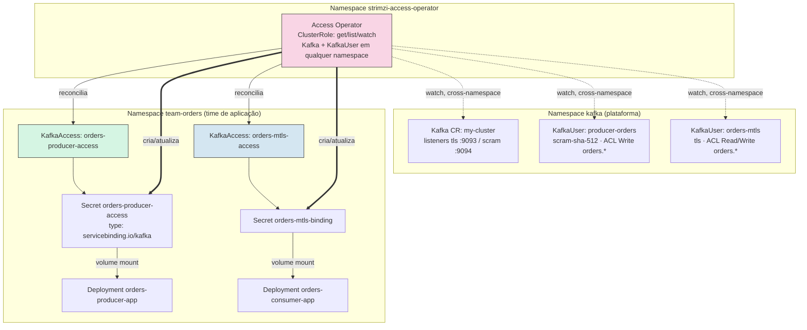
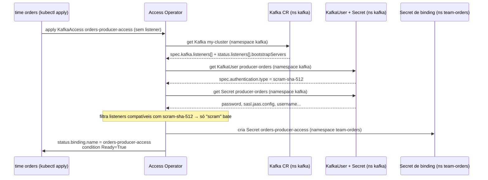

# Kafka Access Operator — Service Binding e Acesso Cross-Namespace sem Copiar Secret

> **Objetivo:** Fechar o buraco que o [Day 4](../Day4-Autenticacao-Autorizacao/) deixou aberto
> de propósito: lá, para um app consumir um `KafkaUser`, alguém tinha que rodar
> `kubectl get secret ... -o jsonpath` na mão, decodificar Base64, montar `client.properties`
> e copiar tudo para dentro de um Pod. Neste Day 5 instalamos o
> **[Strimzi Access Operator](https://github.com/strimzi/kafka-access-operator)** — que
> observa um `Kafka` e um `KafkaUser` (em qualquer namespace) e materializa um único
> `Secret`, no formato padrão da **Service Binding Specification**, dentro da namespace de
> quem realmente vai consumir. Testamos isso com um app de verdade (`Deployment`, não pod de
> debug) rodando numa namespace separada da do cluster Kafka — o cenário mais próximo de
> produção multi-time que dá para montar num laptop.

---

## Índice

1. [Contexto](#1-contexto)
2. [O que é o Kafka Access Operator](#2-o-que-é-o-kafka-access-operator)
3. [Pré-requisitos](#3-pré-requisitos)
4. [Estrutura do Lab](#4-estrutura-do-lab)
5. [Subindo o Cluster Kind](#5-subindo-o-cluster-kind)
6. [Instalando o Strimzi Cluster Operator](#6-instalando-o-strimzi-cluster-operator)
7. [Deploy: Kafka, Tópico e KafkaUsers](#7-deploy-kafka-tópico-e-kafkausers)
8. [Instalando o Kafka Access Operator](#8-instalando-o-kafka-access-operator)
9. [O Primeiro KafkaAccess: Binding SCRAM Cross-Namespace](#9-o-primeiro-kafkaaccess-binding-scram-cross-namespace)
10. [Dissecando o Secret Gerado](#10-dissecando-o-secret-gerado)
11. [Rodando uma Aplicação de Verdade em Cima do Binding](#11-rodando-uma-aplicação-de-verdade-em-cima-do-binding)
12. [Segundo KafkaAccess: mTLS, Secret Customizado e Template de Anotações](#12-segundo-kafkaaccess-mtls-secret-customizado-e-template-de-anotações)
13. [O Teste Negativo: Listener e Autenticação Incompatíveis](#13-o-teste-negativo-listener-e-autenticação-incompatíveis)
14. [Rotação de Credencial de Ponta a Ponta](#14-rotação-de-credencial-de-ponta-a-ponta)
15. [Cross-Namespace na Prática: o que Isso Muda em Termos de RBAC](#15-cross-namespace-na-prática-o-que-isso-muda-em-termos-de-rbac)
16. [Outras Configs que Valem a Pena Olhar](#16-outras-configs-que-valem-a-pena-olhar)
17. [Cleanup](#17-cleanup)
18. [Referências](#18-referências)

---

## 1. Contexto

No [Day 4](../Day4-Autenticacao-Autorizacao/) criamos `KafkaUser`s com mTLS e SCRAM, ACLs
por prefixo, quotas — e para provar que tudo funcionava, extraímos credenciais assim:

```bash
kubectl get secret producer-orders -n kafka -o jsonpath='{.data.sasl\.jaas\.config}' | base64 -d
kubectl get secret admin -n kafka -o jsonpath='{.data.user\.p12}' | base64 -d > admin.p12
```

Isso é perfeitamente razoável **para aprender o que tem dentro da Secret**. Em produção é
outra história:

- Para rodar esses comandos, alguém (ou alguma pipeline de CI/CD) precisa de permissão de
  `get` em `Secret` **na namespace do cluster Kafka** — que normalmente pertence ao time de
  plataforma, não ao time de aplicação. Ou você dá esse acesso (e amplia a superfície de
  quem pode ler qualquer segredo daquela namespace), ou alguém da plataforma vira gargalo
  copiando Secret manualmente toda vez que um time novo precisa de acesso.
- Cada tipo de autenticação tem um formato de Secret diferente (`user.p12` + senha para
  mTLS, `sasl.jaas.config` pronto para SCRAM) — quem consome precisa saber montar
  `client.properties` para cada um.
- Nada resincroniza automaticamente. Se a senha SCRAM rotaciona ou o certificado mTLS é
  renovado, o `client.properties` que você copiou manualmente para dentro do Pod fica
  desatualizado até alguém lembrar de refazer o processo.

O **Access Operator** existe exatamente para isso: ele cria, numa namespace escolhida por
você, um `Secret` único e completo (bootstrap servers, protocolo de segurança, credencial —
o que for aplicável) sempre que você declarar um objeto `KafkaAccess`. Nenhum time de
aplicação precisa de `RBAC` para ler Secret na namespace do Kafka; o operator já tem essa
permissão (via `ClusterRole`) e faz a cópia — com o formato certo — por você.



## 2. O que é o Kafka Access Operator

O [Access Operator](https://github.com/strimzi/kafka-access-operator) é um projeto **separado**
do Strimzi Cluster Operator (repositório próprio, release própria — usamos a `0.3.0` neste
lab). Ele não gerencia o cluster Kafka nem cria `KafkaUser`s; ele só **lê** `Kafka` e
`KafkaUser` já existentes e **materializa** um `Secret` de conexão a partir deles, seguindo a
convenção da [Service Binding Specification for Kubernetes v1.0.0](https://servicebinding.io/spec/core/1.0.0/)
— um padrão que várias linguagens/frameworks já sabem consumir (Spring Cloud Bindings,
Quarkus, bibliotecas de binding em Node/Python), e que aqui vamos consumir manualmente para
deixar claro o que tem dentro.

| Custom Resource | Quem cria | Para que serve |
|---|---|---|
| `Kafka` / `KafkaUser` | Strimzi Cluster Operator (Day 1–4) | Cluster e credenciais |
| `KafkaAccess` | **Você**, na namespace de quem vai consumir | Pede ao Access Operator para materializar o binding |
| `Secret` (`type: servicebinding.io/kafka`) | Access Operator | Resultado: tudo que o app precisa para conectar, num único objeto |

O CRD `KafkaAccess` (`access.strimzi.io/v1alpha1`) é **namespaced** — cada `KafkaAccess` vive
numa namespace específica, igual qualquer outro objeto Kubernetes comum. O que viabiliza o
cross-namespace não é o CRD em si, mas a `ClusterRole` do operator: ele tem `get/list/watch`
em `kafkas` e `kafkausers` **do cluster inteiro**, então um `KafkaAccess` na namespace
`team-orders` pode perfeitamente apontar para um `Kafka` e um `KafkaUser` que vivem na
namespace `kafka` — usando `spec.kafka.namespace` e `spec.user.namespace`. Sem esses dois
campos, o operator assume a própria namespace do `KafkaAccess` (aí só funcionaria se tudo
vivesse junto).

Regras de seleção de listener quando `spec.kafka.listener` não é especificado (direto do
código-fonte do operator, `KafkaParser`):

1. Só um listener no `Kafka` CR → usa esse.
2. Vários listeners → filtra pelos que têm `authentication.type` compatível com o
   `KafkaUser` referenciado (`tls` casa com `tls`/`tls-external`; `scram-sha-512` casa só com
   `scram-sha-512`; sem `KafkaUser`, qualquer listener serve).
3. Ainda há mais de um candidato → prefere `type: internal`.
4. Ainda empatou → ordena por nome alfabeticamente e pega o primeiro.

E se você **especificar** um listener que não bate com a autenticação do `KafkaUser`, o
operator não improvisa — ele recusa e marca o `KafkaAccess` como não pronto (seção 13).

## 3. Pré-requisitos

- [Docker](https://docs.docker.com/get-docker/) com pelo menos ~4GB de RAM livres
- [kind](https://kind.sigs.k8s.io/docs/user/quick-start/#installation)
- [kubectl](https://kubernetes.io/docs/tasks/tools/#kubectl)
- Ter feito o [Day 4](../Day4-Autenticacao-Autorizacao/) (assumimos que você já conhece
  `KafkaUser`, ACLs e a diferença entre autenticação `tls` e `scram-sha-512`)

## 4. Estrutura do Lab

```
Day5-KafkaAccessOperator/
├── kind-config.yaml                 # cluster kind: 1 control-plane + 2 workers
├── kafka-nodepool-controller.yaml   # KafkaNodePool "controller" (3 réplicas)
├── kafka-nodepool-broker.yaml       # KafkaNodePool "broker" (3 réplicas)
├── kafka-cluster.yaml               # Kafka CR: listeners tls + scram, authorization simple
├── kafka-topic-orders.yaml          # KafkaTopic "orders.events"
├── kafkauser-producer-orders.yaml   # KafkaUser SCRAM, Write+Describe em orders.*
├── kafkauser-orders-mtls.yaml       # KafkaUser mTLS, Read+Write+Describe em orders.*
├── namespace-team-orders.yaml       # Namespace separada, dona da aplicação
├── kafkaaccess-orders-scram.yaml    # KafkaAccess cross-namespace, listener automático
├── kafkaaccess-orders-mtls.yaml     # KafkaAccess mTLS, secretName + template de anotações
├── kafkaaccess-mismatch.yaml        # KafkaAccess com listener/auth incompatíveis (teste negativo)
├── app-producer-deployment.yaml     # Deployment consumindo o binding SCRAM via volume
├── app-consumer-deployment.yaml     # Deployment consumindo o binding mTLS via volume
├── README.md
└── README-EN.md
```

## 5. Subindo o Cluster Kind

```bash
kind create cluster --config=kind-config.yaml --name strimzi-day5
kubectl get nodes -o wide
```

## 6. Instalando o Strimzi Cluster Operator

Mesma versão do Day 4 (`1.1.0`), mesmo processo:

```bash
kubectl create namespace kafka

curl -L https://github.com/strimzi/strimzi-kafka-operator/releases/download/1.1.0/strimzi-cluster-operator-1.1.0.yaml \
  | sed 's/namespace: myproject/namespace: kafka/g' \
  | kubectl create -f - -n kafka

kubectl wait deployment/strimzi-cluster-operator -n kafka --for=condition=Available --timeout=180s
```

## 7. Deploy: Kafka, Tópico e KafkaUsers

[`kafka-cluster.yaml`](kafka-cluster.yaml) reaproveita a base do Day 4 — dois listeners TLS
(`tls` para mTLS, `scram` para SASL), `authorization.type: simple` (que resolve para o
`StandardAuthorizer` nativo do KRaft). A única diferença: não precisamos de `superUsers`
neste lab, porque não vamos rodar nenhum comando administrativo — tudo que fazemos passa
pelas ACLs normais dos dois `KafkaUser`s.

```bash
kubectl apply -f kafka-nodepool-controller.yaml -n kafka
kubectl apply -f kafka-nodepool-broker.yaml -n kafka
kubectl apply -f kafka-cluster.yaml -n kafka

kubectl wait kafka/my-cluster --for=condition=Ready --timeout=300s -n kafka
kubectl get pods -n kafka
```

Tópico e os dois `KafkaUser`s ([`kafkauser-producer-orders.yaml`](kafkauser-producer-orders.yaml),
[`kafkauser-orders-mtls.yaml`](kafkauser-orders-mtls.yaml)) — idênticos aos do Day 4:

```bash
kubectl apply -f kafka-topic-orders.yaml -n kafka
kubectl apply -f kafkauser-producer-orders.yaml -n kafka
kubectl apply -f kafkauser-orders-mtls.yaml -n kafka

kubectl wait kafkauser/producer-orders -n kafka --for=condition=Ready --timeout=60s
kubectl wait kafkauser/orders-mtls -n kafka --for=condition=Ready --timeout=60s
```

Neste ponto o cluster está exatamente como no fim do Day 4: dois `KafkaUser`s prontos, cada
um com sua `Secret` na namespace `kafka`. **Ainda não tocamos em nenhuma delas** — é isso que
o Access Operator vai fazer por nós, sem precisarmos rodar `kubectl get secret -o jsonpath`
uma única vez.

## 8. Instalando o Kafka Access Operator

O Access Operator é um projeto separado do Strimzi Cluster Operator, com release própria.
Os manifests de instalação vêm dentro do `.tar.gz` da release (não existe um YAML único
"tudo-em-um" como o do cluster operator):

```bash
curl -L https://github.com/strimzi/kafka-access-operator/releases/download/0.3.0/strimzi-access-operator-0.3.0.tar.gz \
  | tar xz

kubectl apply -f strimzi-access-operator-0.3.0/install
```

Isso cria, entre outras coisas:

| Manifest | O que faz |
|---|---|
| `000-Namespace.yaml` | Cria a namespace `strimzi-access-operator` |
| `010-ServiceAccount.yaml` | ServiceAccount do operator |
| `020-ClusterRole.yaml` | `get/list/watch` em `kafkas` e `kafkausers` (**qualquer namespace**); CRUD completo em `kafkaaccesses` e em `Secret` |
| `030-ClusterRoleBinding.yaml` | Liga a `ClusterRole` à `ServiceAccount` — cluster inteiro |
| `040-Crd-kafkaaccess.yaml` | O CRD `KafkaAccess` (`access.strimzi.io/v1alpha1`, `scope: Namespaced`) |
| `050-Deployment.yaml` | O Deployment do operator (`quay.io/strimzi/access-operator:0.3.0`) |

> **Por que `ClusterRole` e não `Role`:** é justamente essa `ClusterRole` (RBAC de cluster,
> não de namespace) que permite o operator ler um `Kafka` e um `KafkaUser` que vivem numa
> namespace diferente da do `KafkaAccess` que os referencia. Sem isso, o cross-namespace
> binding simplesmente não seria possível — voltamos a detalhar isso na
> [seção 15](#15-cross-namespace-na-prática-o-que-isso-muda-em-termos-de-rbac).

```bash
kubectl wait deployment/strimzi-access-operator -n strimzi-access-operator \
  --for=condition=Available --timeout=120s

kubectl get pods -n strimzi-access-operator
kubectl get crd kafkaaccesses.access.strimzi.io
```

## 9. O Primeiro KafkaAccess: Binding SCRAM Cross-Namespace

Antes de criar o `KafkaAccess`, criamos a namespace que representa o time consumidor —
**deliberadamente separada** da namespace `kafka`:

```bash
kubectl apply -f namespace-team-orders.yaml
```

[`kafkaaccess-orders-scram.yaml`](kafkaaccess-orders-scram.yaml):

```yaml
apiVersion: access.strimzi.io/v1alpha1
kind: KafkaAccess
metadata:
  name: orders-producer-access
spec:
  kafka:
    name: my-cluster
    namespace: kafka        # cluster vive numa namespace diferente da do KafkaAccess
  user:
    kind: KafkaUser
    apiGroup: kafka.strimzi.io
    name: producer-orders
    namespace: kafka        # o KafkaUser também
```

Repare que **não especificamos `spec.kafka.listener`**. Como só referenciamos um
`KafkaUser` do tipo `scram-sha-512`, o operator filtra os dois listeners do cluster e sobra
só o `scram` — a regra 2 da seleção automática descrita na [seção 2](#2-o-que-é-o-kafka-access-operator).

```bash
kubectl apply -f kafkaaccess-orders-scram.yaml -n team-orders

kubectl get kafkaaccess -n team-orders
kubectl wait kafkaaccess/orders-producer-access -n team-orders \
  --for=condition=Ready --timeout=60s
```

Saída esperada de `kubectl get kafkaaccess -n team-orders` (colunas vêm do
`additionalPrinterColumns` do CRD):

```
NAME                      LISTENER   CLUSTER      USER              READY
orders-producer-access               my-cluster   producer-orders   True
```

A coluna `LISTENER` aparece vazia porque não a especificamos no CR — mas o Secret gerado
(próxima seção) mostra que o operator resolveu para o listener `scram` de qualquer forma.
Confirme com:

```bash
kubectl get kafkaaccess orders-producer-access -n team-orders -o jsonpath='{.status}' | jq .
```

```json
{
  "binding": { "name": "orders-producer-access" },
  "conditions": [
    { "type": "Ready", "status": "True", "reason": "Ready", "message": "Ready" }
  ],
  "observedGeneration": 1
}
```

`status.binding.name` é o nome do `Secret` que foi criado — por padrão, **igual ao nome do
próprio `KafkaAccess`** (só muda se você definir `spec.secretName`, o que fazemos no segundo
exemplo, [seção 12](#12-segundo-kafkaaccess-mtls-secret-customizado-e-template-de-anotações)).

O fluxo completo de reconciliação, do `kubectl apply` até o `Secret` pronto:



## 10. Dissecando o Secret Gerado

```bash
kubectl get secret orders-producer-access -n team-orders -o json \
  | jq -r '.data | to_entries[] | "\(.key)=\(.value | @base64d)"'
```

Saída (valores truncados/ilustrativos):

```
type=kafka
provider=strimzi
bootstrap.servers=my-cluster-kafka-bootstrap.kafka.svc:9094
bootstrap-servers=my-cluster-kafka-bootstrap.kafka.svc:9094
bootstrapServers=my-cluster-kafka-bootstrap.kafka.svc:9094
security.protocol=SASL_SSL
securityProtocol=SASL_SSL
ssl.truststore.crt=-----BEGIN CERTIFICATE-----\n...
username=producer-orders
user=producer-orders
sasl.mechanism=SCRAM-SHA-512
saslMechanism=SCRAM-SHA-512
password=************
sasl.jaas.config=org.apache.kafka.common.security.scram.ScramLoginModule required username="producer-orders" password="************";
```

Alguns detalhes que valem a pena entender (direto do código-fonte do operator —
`SecretDependentResource`, `KafkaListener` e `KafkaUserData`):

- **A mesma informação aparece em 2 ou 3 convenções de nome de chave.**
  `bootstrap.servers` (formato "propriedade Kafka", com ponto), `bootstrap-servers` (Spring
  Boot usa esse com hífen) e `bootstrapServers` (camelCase, é o que o Quarkus espera). O
  mesmo vale para `security.protocol`/`securityProtocol` e `sasl.mechanism`/`saslMechanism`.
  Isso existe para que **frameworks diferentes consumam o mesmo `Secret` sem transformação
  nenhuma** — cada framework de Service Binding já sabe procurar a convenção que ele usa.
- **`ssl.truststore.crt` só aparece porque o listener escolhido é TLS.** Se o cluster tivesse
  um listener sem TLS, essa chave simplesmente não existiria no Secret.
- **`sasl.jaas.config` já vem pronto para usar como valor de propriedade Java**, igual você
  viu no Day 4 direto na Secret do `KafkaUser` — o operator só copia essa chave específica da
  Secret original.
- O `Secret` inteiro tem `type: servicebinding.io/kafka` e o label
  `app.kubernetes.io/managed-by: kafka-access-operator` — dá para listar todos os bindings
  gerenciados no cluster com `kubectl get secrets -A -l app.kubernetes.io/managed-by=kafka-access-operator`.

## 11. Rodando uma Aplicação de Verdade em Cima do Binding

Esse é o ponto central do lab: uma aplicação rodando na namespace `team-orders` — que
**nunca** teve acesso de leitura à namespace `kafka` — publica mensagens reais em
`orders.events` usando só o `Secret` que o Access Operator gerou.

A Service Binding Specification define que o `Secret` deve ser **montado como volume**, não
lido via `envFrom` — e faz sentido: várias chaves têm ponto no nome (`sasl.jaas.config`,
`bootstrap.servers`), que é inválido como nome de variável de ambiente Kubernetes (o
Kubernetes descarta silenciosamente, com um evento de warning, qualquer chave de `envFrom`
que não seja um identificador C válido). Como **arquivo**, o nome da chave vira o nome do
arquivo — pontos não são problema nenhum.

[`app-producer-deployment.yaml`](app-producer-deployment.yaml) monta o Secret em
`/bindings/kafka` e usa um script de entrada que lê os arquivos e monta o
`client.properties` na hora — o mesmo trabalho que uma biblioteca de Service Binding
(Spring Cloud Bindings, Quarkus) faria por você automaticamente:

```yaml
volumes:
  - name: kafka-binding
    secret:
      secretName: orders-producer-access
containers:
  - name: producer
    volumeMounts:
      - name: kafka-binding
        mountPath: /bindings/kafka
        readOnly: true
    command: ["/bin/bash", "-c"]
    args:
      - |
        BIND=/bindings/kafka
        cat > /tmp/client.properties <<EOF
        security.protocol=$(cat "$BIND/security.protocol")
        sasl.mechanism=$(cat "$BIND/sasl.mechanism")
        sasl.jaas.config=$(cat "$BIND/sasl.jaas.config")
        ssl.truststore.type=PEM
        ssl.truststore.location=$BIND/ssl.truststore.crt
        EOF
        BOOTSTRAP=$(cat "$BIND/bootstrap.servers")
        # ...loop de produção, ver arquivo completo
```

```bash
kubectl apply -f app-producer-deployment.yaml -n team-orders
kubectl rollout status deployment/orders-producer-app -n team-orders --timeout=90s
kubectl logs -f deployment/orders-producer-app -n team-orders
```

Saída esperada (loga a cada 5s):

```
Conectando em my-cluster-kafka-bootstrap.kafka.svc:9094 como producer-orders
>>
```

A confirmação de que as mensagens realmente chegam no tópico vem na próxima seção, quando
subimos o `Deployment` consumidor — que usa um binding **diferente** (mTLS), de um
`KafkaUser` diferente, montado a partir de outro `KafkaAccess`. Duas aplicações, duas
namespaces de credencial de origem, o mesmo tópico.

> **O que prova esse teste:** o time `orders` nunca rodou `kubectl get secret` na namespace
> `kafka`, nunca precisou saber que `producer-orders` usa SCRAM nem como montar um JAAS
> config. Só aplicou um `KafkaAccess` de 10 linhas na própria namespace e montou o `Secret`
> resultante como qualquer outro — exatamente como faria com um binding de banco de dados
> criado por um operator de RDS, por exemplo.

## 12. Segundo KafkaAccess: mTLS, Secret Customizado e Template de Anotações

[`kafkaaccess-orders-mtls.yaml`](kafkaaccess-orders-mtls.yaml) usa o `KafkaUser` mTLS
(`orders-mtls`) e explora dois campos que não usamos no primeiro exemplo:

```yaml
apiVersion: access.strimzi.io/v1alpha1
kind: KafkaAccess
metadata:
  name: orders-mtls-access
spec:
  kafka:
    name: my-cluster
    namespace: kafka
    listener: tls
  user:
    kind: KafkaUser
    apiGroup: kafka.strimzi.io
    name: orders-mtls
    namespace: kafka
  secretName: orders-mtls-binding      # nome custom em vez do default (nome do CR)
  template:
    secret:
      metadata:
        annotations:
          reloader.stakater.com/match: "true"
        labels:
          team: orders
```

- **`secretName`** — sem esse campo, o Secret se chamaria `orders-mtls-access` (igual ao CR).
  Com ele, se chama `orders-mtls-binding`. Útil quando várias `KafkaAccess` precisam
  convergir para um nome de Secret que uma aplicação já espera por convenção própria.
- **`template.secret.metadata`** (anotações/labels) — feature da release `0.3.0`. Qualquer
  anotação ou label aqui é mesclada no Secret gerado, **sem sobrescrever** o que já existe
  nele (o operator faz merge preservando o conteúdo atual). Usamos isso para marcar o Secret
  com `reloader.stakater.com/match: "true"`, a anotação que o
  [Stakater Reloader](https://github.com/stakater/Reloader) usa para saber quais Secrets
  observar — fechamos esse ciclo na [seção 14](#14-rotação-de-credencial-de-ponta-a-ponta).

```bash
kubectl apply -f kafkaaccess-orders-mtls.yaml -n team-orders
kubectl wait kafkaaccess/orders-mtls-access -n team-orders --for=condition=Ready --timeout=60s

kubectl get secret orders-mtls-binding -n team-orders \
  -o jsonpath='{.metadata.annotations}' | jq .
```

O Secret mTLS traz `ssl.keystore.crt` e `ssl.keystore.key` — **PEM puro**, não o
`user.p12` (PKCS12) que extraímos manualmente no Day 4. Isso é proposital: desde o
[KIP-651](https://cwiki.apache.org/confluence/display/KAFKA/KIP-651+-+Support+PEM+format+for+SSL+certificates+and+private+key)
(Kafka 2.7+), o cliente Kafka lê certificado e chave PEM **diretamente**, sem keystore
intermediário nem senha de keystore:

```properties
ssl.keystore.type=PEM
ssl.keystore.location=/tmp/keystore.pem   # arquivo com CERTIFICATE + PRIVATE KEY concatenados
```

[`app-consumer-deployment.yaml`](app-consumer-deployment.yaml) faz exatamente isso —
concatena os dois arquivos montados do binding num único PEM e aponta
`ssl.keystore.location` para ele:

```bash
cat "$BIND/ssl.keystore.crt" "$BIND/ssl.keystore.key" > /tmp/keystore.pem
```

```bash
kubectl apply -f app-consumer-deployment.yaml -n team-orders
kubectl rollout status deployment/orders-consumer-app -n team-orders --timeout=90s
kubectl logs -f deployment/orders-consumer-app -n team-orders
```

As mensagens que o `orders-producer-app` está publicando (seção 11) devem aparecer aqui —
dois `Deployment`s, dois mecanismos de autenticação diferentes (SCRAM e mTLS), dois
`Secret`s de binding diferentes, **nenhum dos dois** tocando a namespace `kafka`.

## 13. O Teste Negativo: Listener e Autenticação Incompatíveis

[`kafkaaccess-mismatch.yaml`](kafkaaccess-mismatch.yaml) referencia o listener `tls`
(mTLS) mas aponta para o `KafkaUser` `producer-orders`, que é `scram-sha-512`:

```yaml
spec:
  kafka:
    name: my-cluster
    namespace: kafka
    listener: tls          # <- exige autenticação tls
  user:
    name: producer-orders  # <- mas esse usuário é scram-sha-512
    namespace: kafka
```

```bash
kubectl apply -f kafkaaccess-mismatch.yaml -n team-orders
kubectl get kafkaaccess orders-mismatch-access -n team-orders
```

```
NAME                     LISTENER   CLUSTER      USER              READY
orders-mismatch-access   tls        my-cluster   producer-orders   False
```

```bash
kubectl get kafkaaccess orders-mismatch-access -n team-orders \
  -o jsonpath='{.status.conditions[0].message}'
```

```
Provided listener tls and Kafka User do not have compatible authentication configurations.
```

**Nenhum `Secret` é criado.** O `KafkaParser` do operator valida a compatibilidade entre
`authentication.type` do listener e `authentication.type` do `KafkaUser` *antes* de montar
qualquer dado de conexão — a mesma tabela de compatibilidade da
[seção 2](#2-o-que-é-o-kafka-access-operator) (`tls` só casa com `tls`/`tls-external`;
`scram-sha-512` só casa com `scram-sha-512`). Isso evita o pior cenário possível: gerar um
binding que parece válido mas nunca vai autenticar de verdade contra aquele listener.

Limpe o exemplo antes de seguir:

```bash
kubectl delete -f kafkaaccess-mismatch.yaml -n team-orders
```

## 14. Rotação de Credencial de Ponta a Ponta

Esse é o teste que mais se aproxima de um incidente real de produção: **a credencial por
trás de um `KafkaAccess` muda — o binding acompanha sozinho?**

Para `KafkaUser`s mTLS, o Strimzi User Operator suporta renovação sob demanda via anotação
na própria Secret do usuário:

```bash
# fingerprint do certificado ANTES da renovação
kubectl get secret orders-mtls -n kafka -o jsonpath='{.data.user\.crt}' | base64 -d \
  | openssl x509 -noout -fingerprint -sha256

kubectl annotate secret orders-mtls -n kafka strimzi.io/force-renew="true"
```

Na próxima reconciliação do User Operator, um novo par certificado/chave é gerado na Secret
`orders-mtls` (namespace `kafka`) e a anotação é removida automaticamente. O Access Operator
também está observando essa Secret (é uma das duas fontes de eventos que ele registra —
`KAFKA_USER_SECRET_EVENT_SOURCE`), então ele **reconcilia sozinho** o `KafkaAccess`
`orders-mtls-access` e atualiza o conteúdo do `Secret` `orders-mtls-binding` na namespace
`team-orders` — sem nenhum comando adicional seu lá:

```bash
# espere alguns segundos pela reconciliação do User Operator + Access Operator
kubectl get secret orders-mtls-binding -n team-orders -o jsonpath='{.data.ssl\.keystore\.crt}' \
  | base64 -d | openssl x509 -noout -fingerprint -sha256
```

O fingerprint deve ser **diferente** do primeiro — a namespace `team-orders` recebeu o
certificado novo automaticamente. O que ela **não** recebe de graça é o restart do Pod que já
carregou o certificado antigo na memória — é aí que entra a anotação
`reloader.stakater.com/match: "true"` que colocamos no `template.secret` da
[seção 12](#12-segundo-kafkaaccess-mtls-secret-customizado-e-template-de-anotações): se o
[Stakater Reloader](https://github.com/stakater/Reloader) estiver instalado no cluster e o
`Deployment` `orders-consumer-app` tiver a anotação equivalente
(`reloader.stakater.com/auto: "true"`), ele reinicia o Pod sozinho assim que detecta a
mudança no Secret — fechando o ciclo sem nenhuma ação humana, do `force-renew` até o Pod
novo em pé. Neste lab não instalamos o Reloader (foge do escopo), mas você pode confirmar o
efeito manualmente:

```bash
kubectl rollout restart deployment/orders-consumer-app -n team-orders
```

> **Por que isso não funciona igual para SCRAM:** a anotação `strimzi.io/force-renew` é
> tratada pelo User Operator só no caminho de geração de **certificado** — no código do
> `KafkaUserModel`, a lógica que gera a senha SCRAM (`maybeGeneratePassword`) reaproveita a
> senha existente na Secret sempre que ela já existir, sem checar a anotação. Para forçar a
> rotação de uma senha SCRAM, é preciso remover a chave `password` da Secret do `KafkaUser`
> (ou apagar a Secret inteira) para o User Operator gerar uma nova no próximo reconcile — uma
> assimetria real entre os dois mecanismos, que vale a pena documentar no runbook de
> qualquer time que dependa disso.

## 15. Cross-Namespace na Prática: o que Isso Muda em Termos de RBAC

Vale reforçar o motivo pelo qual isso é mais seguro do que dar `get secret` cross-namespace
direto para os times de aplicação:

| Sem Access Operator | Com Access Operator |
|---|---|
| Time `orders` precisa de `RoleBinding` (ou pior, `ClusterRoleBinding`) com `get` em `Secret` na namespace `kafka` | Time `orders` só precisa de permissão para ler `Secret` **na própria namespace** (`team-orders`) — RBAC padrão de qualquer app |
| Esse RBAC dá acesso a **qualquer** Secret da namespace `kafka` (inclusive Secrets de outros times/clusters que morem lá) | O Access Operator só copia exatamente os campos de conexão — nunca dá acesso de leitura genérico à namespace de origem |
| Rotação de credencial exige alguém lembrar de recopiar manualmente | Reconciliação automática (seção 14) |
| Cada app monta `client.properties` do seu próprio jeito | Formato único, padronizado pela Service Binding Spec |

O trade-off é que o **operator em si** roda com uma `ClusterRole` bem privilegiada (lê
`Kafka`/`KafkaUser` de qualquer namespace, cria/edita `Secret` de qualquer namespace). Isso é
esperado — ele é a peça central de plataforma que faz a ponte — mas é também o motivo pelo
qual só o time de plataforma deveria ter permissão para instalar/atualizar o Access Operator,
igual acontece com o próprio Strimzi Cluster Operator.

## 16. Outras Configs que Valem a Pena Olhar

Fica de gancho para explorar (e para os próximos vídeos da série):

- **`spec.kafka.listener` sempre explícito em produção.** A seleção automática é ótima para
  laboratório; num cluster com vários listeners internos/externos, ser explícito evita que
  uma mudança na ordem alfabética dos nomes dos listeners troque silenciosamente o listener
  escolhido numa reconciliação futura.
- **Múltiplos `KafkaAccess` para o mesmo `KafkaUser`**, cada um em uma namespace de time
  diferente — o mesmo `producer-orders` pode ser compartilhado (com cuidado) entre times que
  legitimamente publicam no mesmo tópico, sem duplicar o `KafkaUser`.
- **Bibliotecas de Service Binding nativas** — em vez do script de shell que usamos aqui,
  aplicações Spring Boot (`spring-cloud-bindings`) ou Quarkus (`quarkus-kubernetes-service-binding`)
  leem o volume automaticamente e populam `application.properties`/config sozinhas, sem
  nenhum código de parsing seu.
- **Helm chart oficial** (`strimzi-access-operator-helm-3-chart`, publicado junto de cada
  release) — alternativa ao `kubectl apply -f install` para quem já gerencia operators via
  Helm, com suporte a customizar `PodSecurityContext`, anotações e labels do Deployment.

## 17. Cleanup

```bash
kubectl delete -f app-producer-deployment.yaml -n team-orders
kubectl delete -f app-consumer-deployment.yaml -n team-orders
kubectl delete -f kafkaaccess-orders-scram.yaml -n team-orders
kubectl delete -f kafkaaccess-orders-mtls.yaml -n team-orders
kubectl delete namespace team-orders

kubectl -n kafka delete $(kubectl get strimzi -o name -n kafka)
kubectl get pvc -n kafka   # devem sumir sozinhas por causa do deleteClaim: true

kubectl delete -f strimzi-access-operator-0.3.0/install
rm -rf strimzi-access-operator-0.3.0

kind delete cluster --name strimzi-day5
```

## 18. Referências

| Recurso | URL |
|---|---|
| Strimzi Access Operator — repositório | https://github.com/strimzi/kafka-access-operator |
| Strimzi Access Operator — release usada neste lab (0.3.0) | https://github.com/strimzi/kafka-access-operator/releases/tag/0.3.0 |
| Service Binding Specification for Kubernetes v1.0.0 | https://servicebinding.io/spec/core/1.0.0/ |
| KIP-651 — Support PEM format for SSL certificates and private key | https://cwiki.apache.org/confluence/display/KAFKA/KIP-651+-+Support+PEM+format+for+SSL+certificates+and+private+key |
| Strimzi — Manually renewing KafkaUser certificates (`force-renew`) | https://github.com/strimzi/strimzi-kafka-operator/blob/main/documentation/modules/security/con-securing-client-authentication.adoc |
| Stakater Reloader | https://github.com/stakater/Reloader |
| Strimzi — KafkaUser API Reference | https://strimzi.io/docs/operators/latest/configuring#type-KafkaUser-reference |

---

> Parte da série **Espetinho de Kafka** — Strimzi Day 5: Kafka Access Operator.
> Day anterior: [Autenticação e Autorização](../Day4-Autenticacao-Autorizacao/).
> Próximo Day: [Cruise Control](../Day6-CruiseControl/) — rebalanceamento automático e
> self-healing de partições entre brokers.
